 <div id="top"></div>
<!--
*** Thanks for checking out the Best-README-Template. If you have a suggestion
*** that would make this better, please fork the repo and create a pull request
*** or simply open an issue with the tag "enhancement".
*** Don't forget to give the project a star!
*** Thanks again! Now go create something AMAZING! :D
-->


<!-- PROJECT SHIELDS -->
<!--
*** I'm using markdown "reference style" links for readability.
*** Reference links are enclosed in brackets [ ] instead of parentheses ( ).
*** See the bottom of this document for the declaration of the reference variables
*** for contributors-url, forks-url, etc. This is an optional, concise syntax you may use.
*** https://www.markdownguide.org/basic-syntax/#reference-style-links
-->


# Programación Competitiva

## Ejercicios_21-10-2021


### StoneWall

* Complejidad O(n)
  ```cpp
   #include <bits/stdc++.h>
    using namespace std;

    int stoneWall(vector<int>& H){
        stack<int> height;
        int cntBlock = 0;
        
        for (size_t i = 0; i < H.size(); i++)
        {
            while (!height.empty() && height.top()>H[i] ) height.pop();
            if (height.empty())
            {
                cntBlock++;
                height.push(H[i]);
            }
            else if(height.top() == H[i]){;}
            else if(height.top() < H[i]){
                cntBlock++;
                height.push(H[i]);
            }
        }
        return cntBlock;
    }

    int main ()
    {   
        ios_base::sync_with_stdio(false);
        cin.tie(NULL);

        int n;    
        cin>>n;
        vector<int> H(n);

        for (size_t i = 0; i < n; i++) cin>>H[i];
        
        // for(auto x : H) cout<<x<<" ";

        cout<<stoneWall(H)<<"\n";
        return 0;
        
    }
    ```

<p align="right">(<a href="https://github.com/kpzaolod6000/Programacion_Competitiva/tree/main/ejercicios_21-10-2021/StoneWall.cpp">code link</a>)</p>


### Codility screenshots

<div>
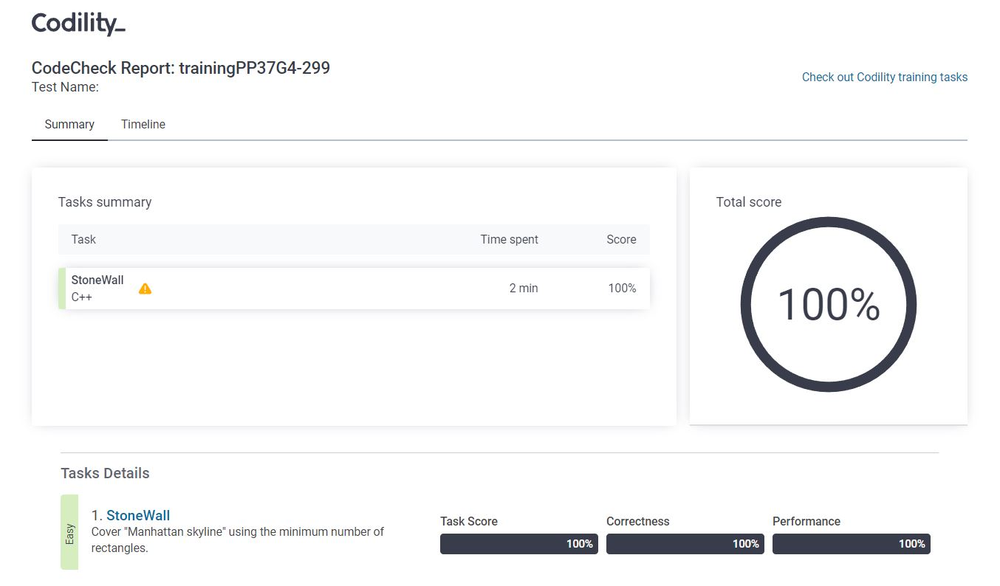
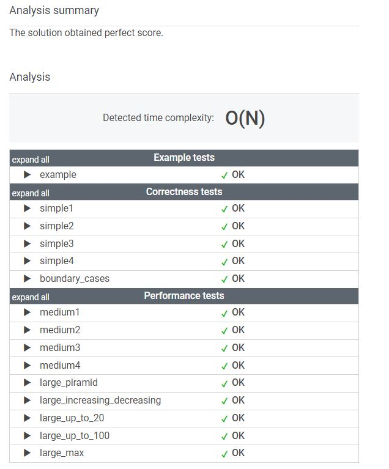
</div>


### Nesting

* Complejidad O(n)
  ```cpp
    #include <bits/stdc++.h>
    using namespace std;

    int nesting(string& S){
        stack<int> parenth;
        char ch;
        for (size_t i = 0; i < S.size(); i++)
        {
            ch = S[i];
            if (ch == '(') parenth.push('(');
            else
            {
                if(parenth.empty() || parenth.top() != '(') return 0;
                else parenth.pop();
            }
        }
        return parenth.size() > 0 ? 0 : 1;
    }

    int main ()
    {   
        ios_base::sync_with_stdio(false);
        cin.tie(NULL);
        
        string text;
        getline(cin, text);

        cout<<nesting(text)<<"\n";
        return 0;
        
    }
    ```

<p align="right">(<a href="https://github.com/kpzaolod6000/Programacion_Competitiva/tree/main/ejercicios_21-10-2021/Nesting.cpp">code link</a>)</p>


### Codility screenshots

<div>

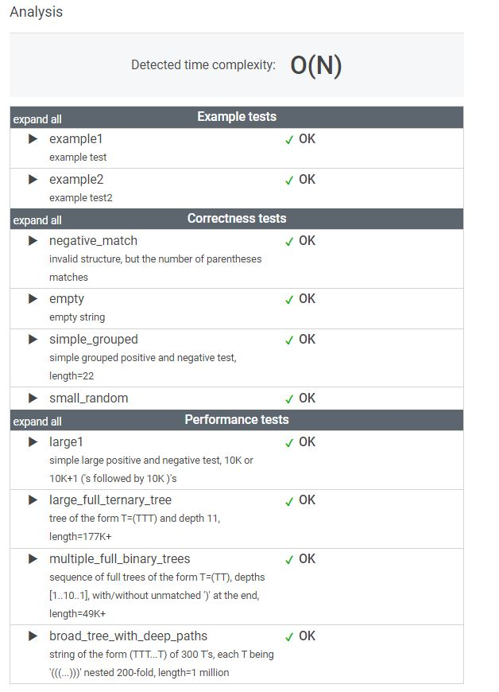
</div>


### Fish

* Complejidad O(n)
  ```cpp
    #include <bits/stdc++.h>
    using namespace std;
    int fish(vector<int>& A,vector<int>& B){
        if (A.size() == 0) return 0;
        
        stack<int> fishDepretator;
        int fishLive = A.size();
        for (size_t i = 0; i < A.size(); i++)
        {
            if(B[i] == 1){
                fishDepretator.push(A[i]);
            }
            else //B[i] == 0
            {
                while (!fishDepretator.empty())
                {
                    if (fishDepretator.top() > A[i])
                    {
                        fishLive--;
                        break;
                    }else if (fishDepretator.top()<A[i]){
                        fishLive--;
                        fishDepretator.pop();
                    }
                    
                }
                
            }
        }
        return fishLive;
    }

    int main ()
    {   
        ios_base::sync_with_stdio(false);
        cin.tie(NULL);
        
        int n;
        cin>>n;
        vector<int> A(n);
        vector<int> B(n);
        for (size_t i = 0; i < n; i++) cin>>A[i];
        for (size_t i = 0; i < n; i++) cin>>B[i];
        
        cout<<fish(A,B)<<"\n";
        return 0;
        
    }
    ```

<p align="right">(<a href="https://github.com/kpzaolod6000/Programacion_Competitiva/tree/main/ejercicios_21-10-2021/Fish.cpp">code link</a>)</p>


### Codility screenshots

<div>

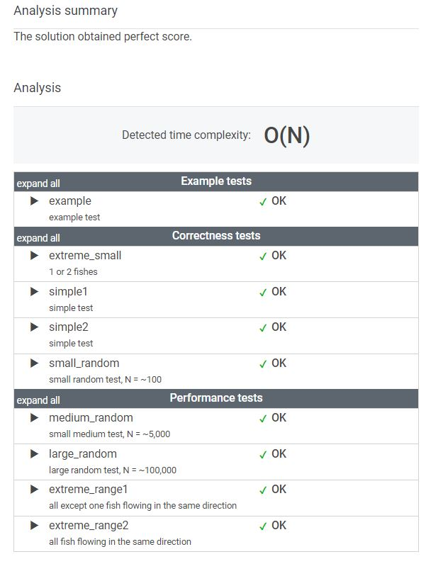
</div>


### Brackets

* Complejidad O(n)
  ```cpp
    #include <bits/stdc++.h>
    using namespace std;

    int brackets(string& S){
        
        stack<int> N_oper;
        char ch;
        if (S.empty()) return 1;

        for (size_t i = 0; i < S.size(); i++)
        { 
            switch (S[i]){
                case '(':
                    N_oper.push(')');
                    break;
                case '[':
                    N_oper.push(']');
                    break;
                case '{':
                    N_oper.push('}');
                    break;
                default:
                    if (N_oper.empty()) return 0;
                    else
                    {
                        ch = S[i];
                        if (ch != N_oper.top()) return 0;
                        N_oper.pop();
                    }
                    break;
            }
        }

        return N_oper.size() > 0 ? 0 : 1;
    }

    int main ()
    {   
        ios_base::sync_with_stdio(false);
        cin.tie(NULL);
        
        // int n;
        // cin>>n;

        string text;
        getline(cin, text);

        // cout<<text<<"\n";
        
        cout<<brackets(text)<<"\n";
        return 0;
        
    }


    ```

<p align="right">(<a href="https://github.com/kpzaolod6000/Programacion_Competitiva/tree/main/ejercicios_21-10-2021/brackets.cpp">code link</a>)</p>


### Codility screenshots

<div>

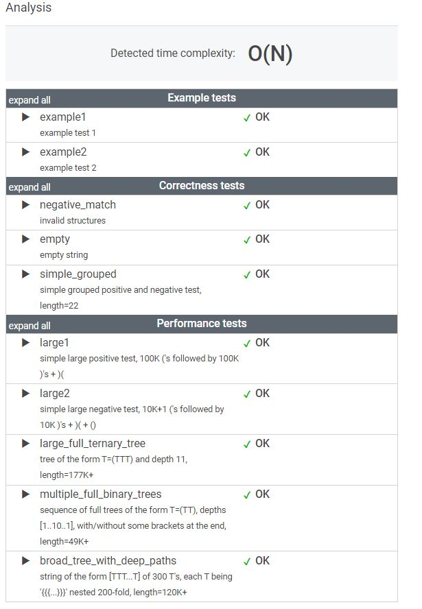
</div>


## Ejercicios_20-10-2021

### Evaluate Reverse Polish Notation

* Complejidad O(n)
  ```cpp
    #include <bits/stdc++.h>
    using namespace std;


    int evalRPN(vector<string>& tokens){
        stack<int> result;
        int x_val,y_val;

        for (size_t i = 0; i < tokens.size(); i++)
        {
            string ch = tokens[i];
            if( ch=="+" || ch=="-" || ch=="*" || ch=="/"){
                y_val = result.top();
                result.pop();
                x_val = result.top();
                result.pop();
                if (ch == "+") result.push(x_val + y_val);
                else if (ch == "-") result.push(x_val - y_val);
                else if (ch == "*") result.push(x_val * y_val);
                else if (ch == "/") result.push(x_val / y_val);
            }else{
                result.push(stoi(ch));
            }
        }
        return result.top();
        
    }

    int main(){
        ios_base::sync_with_stdio(false);
        cin.tie(NULL);
    
        
        vector<string> arr ={"2","1","+","3","*"};
        cout<<evalRPN(arr)<<"\n";
        
        vector<string> arr2 ={"10","6","9","3","+","-11","*","/","*","17","+","5","+"};
        cout<<evalRPN(arr2)<<"\n";
        
        return 0;
    }
    ```

<p align="right">(<a href="https://github.com/kpzaolod6000/Programacion_Competitiva/tree/main/ejercicios_20-10-2021/EvaluateReversePolishNotation.cpp">code link</a>)</p>


### LeetCode screenshots

<div>
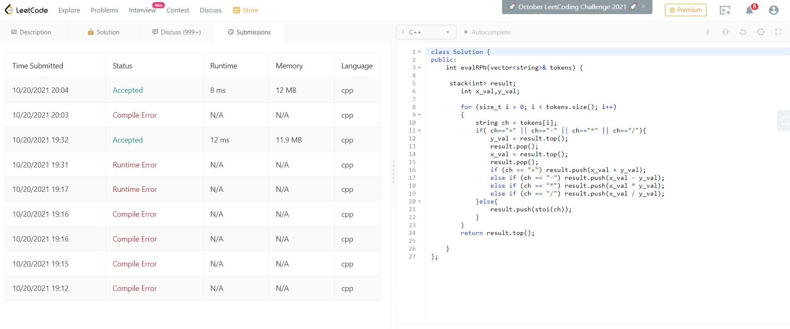
</div>

### Minimum Add to Make Parentheses Valid


* Complejidad O(n)
  ```cpp
    #include <bits/stdc++.h>
    using namespace std;

    int minAddToMakeValid(string s) {
        stack<char> parenth;
        parenth.push(s[0]);
        
        for (size_t i = 1; i < s.size(); i++)
        {
            char ch = s[i];
            if(parenth.empty()) parenth.push(ch);
            else 
            {
                char ins = parenth.top();
                
                if (ins == ch || ch < ins) parenth.push(ch);
                else parenth.pop();
            }
                
        }
        return parenth.size();
        
    }

    int main ()
    {   
        ios_base::sync_with_stdio(false);
        cin.tie(NULL);
        
        
        string arr = "())";
        cout<<minAddToMakeValid(arr)<<"\n";
        
        string arr2 ="()))((";
        cout<<minAddToMakeValid(arr2)<<"\n";
        
        return 0;

    }
    ```

<p align="right">(<a href="https://github.com/kpzaolod6000/Programacion_Competitiva/tree/main/ejercicios_20-10-2021/MinimumAddtoMakeParenthesesValid.cpp">code link</a>)</p>

### LeetCode screenshots

<div>
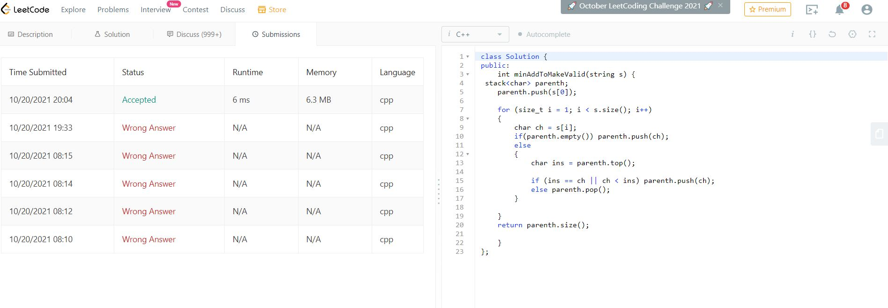
</div>


### Score of Parentheses

* Complejidad O(n)
  ```cpp
    #include <bits/stdc++.h>
    using namespace std;

    int score_OfParentheses(string s) {
        
        stack<int> parenthBalanced;
        int score_ = 0;
        char ch;
        
        for (size_t i = 0; i < s.size(); i++)
        {
            ch = s[i];
            if (ch == '(')
            {
                parenthBalanced.push(score_);
                score_ = 0;
            }else{
                score_ = parenthBalanced.top() + max(score_*2,1);
                parenthBalanced.pop();
            }
        }

        return score_;

        
    }

    int main ()
    {   
        ios_base::sync_with_stdio(false);
        cin.tie(NULL);
        
        string arr ="()()";
        cout<<score_OfParentheses(arr)<<"\n";

        string arr2 ="(()(()))";
        cout<<score_OfParentheses(arr2)<<"\n";

        return 0;

    }
    ```

<p align="right">(<a href="https://github.com/kpzaolod6000/Programacion_Competitiva/tree/main/ejercicios_20-10-2021/scoreOfParentheses.cpp">code link</a>)</p>


### LeetCode screenshots

<div>
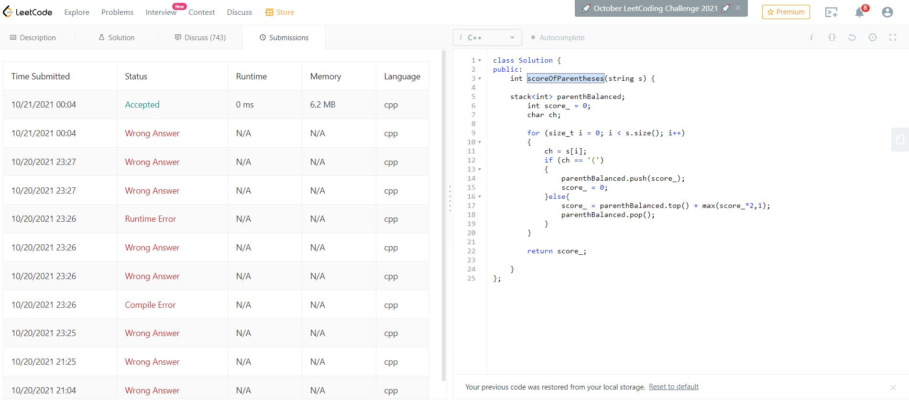
</div>

## Ejercicios_18-10-2021

### Disastrous Downtime


* Complejidad O(n)
  ```cpp
    #include <bits/stdc++.h>
    using namespace std;

    vector<int> sums(vector<int> arr){
    
        vector<int> aux;
        aux.push_back(arr[0]);
        for (size_t i = 1; i < arr.size(); i++) aux.push_back(aux.back() + arr[i]);
        return aux;

    }

    int DisastrousDowntime(vector<int> &arr,int k){
        
        int n = arr[arr.size()-1];
        int miliscnd = 1000;
        vector<int> times(n+miliscnd+1);
        
        int time;
        for (size_t i = 0; i < arr.size(); i++)
        {
            time = arr[i];
            times[time]++;
            time += miliscnd;
            times[time]--;
        }
        vector<int> sumTime = sums(times);
        sort (sumTime.begin(), sumTime.end());
        
        return ceil((1.0 * sumTime[sumTime.size() - 1])/k);
        
    }

    int main(){
        ios_base::sync_with_stdio(false);
        cin.tie(NULL);
        
        int n,k;
        cin >> n >>k;

        vector<int> arr(n);
        for (size_t i= 0;i < n; i++) cin>>arr[i];
        cout<<DisastrousDowntime(arr,k);

        cout<<"\n";
        return 0;
    } 
    ```

<p align="right">(<a href="https://github.com/kpzaolod6000/Programacion_Competitiva/tree/main/ejercicios_18-10-2021/DisastrousDowntime.cpp">code link</a>)</p>

### OpenKattis screenshots
<ul>

<li>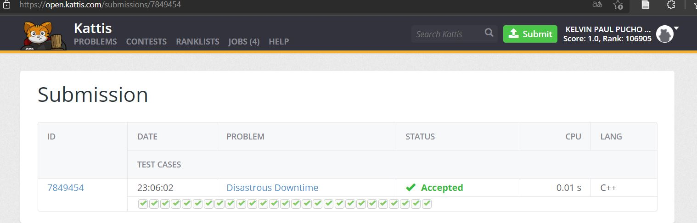</li>
<li>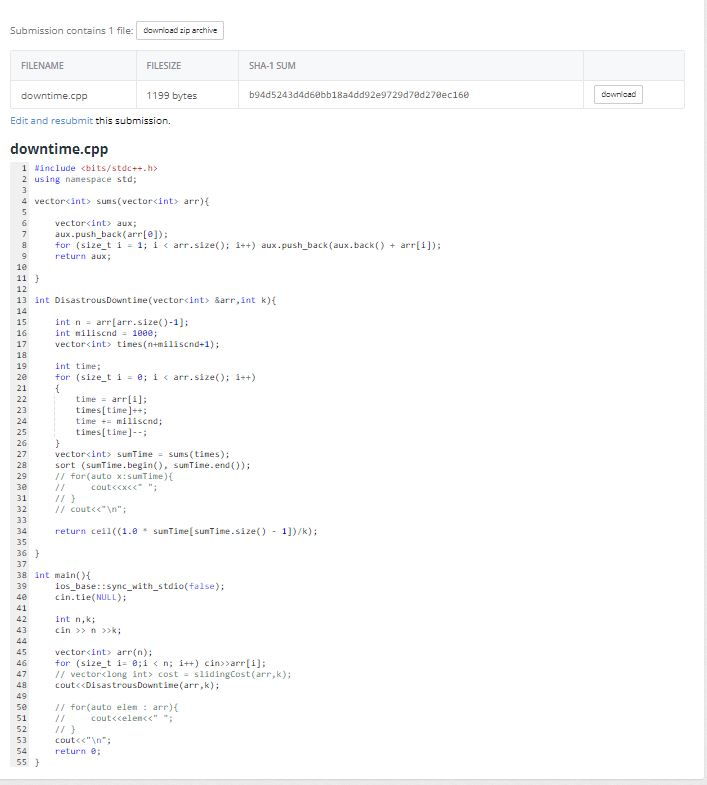</li>
<li>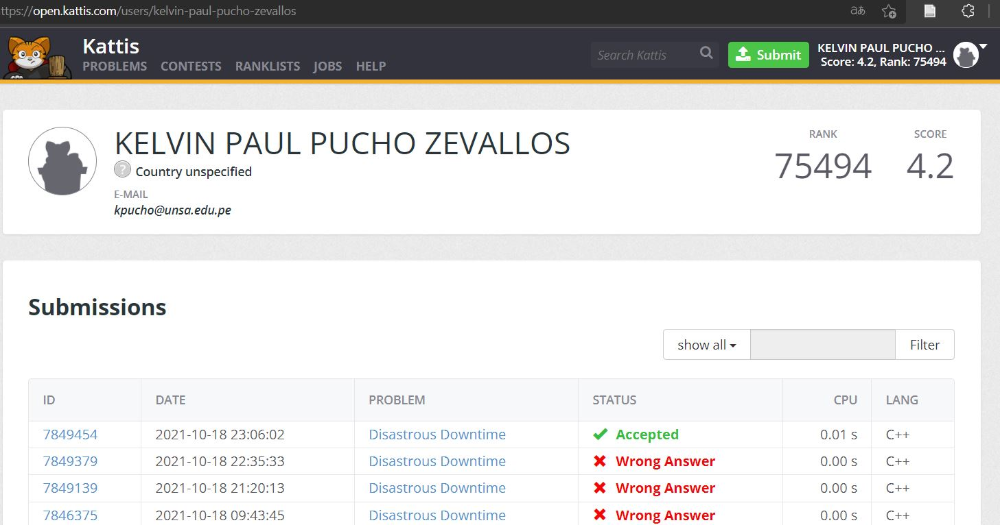</li>
</ul>

### Haybale Stacking


* Complejidad O(n)
  ```cpp
    #include <bits/stdc++.h>

    using namespace std;

    vector<int> sumsPrefix(vector<int> arr){a
    
        vector<int> aux;
        aux.push_back(0);
        for (size_t i = 0; i < arr.size(); i++) aux.push_back(aux.back() + arr[i]);
        return aux;

    }

    int HaybaleStacking(vector<int> &arr,int k){
        int A,B;
        while (k > 0)
        {
            cin>>A>>B;
            arr[A]++;
            arr[B+1]--;
            k--;
        }
        vector<int> rpt = sumsPrefix(arr);
        sort (rpt.begin(), rpt.end());
   
        return arr[arr.size()/2+1];
    }

    int main(){
        ios_base::sync_with_stdio(false);
        cin.tie(NULL);
    
        int n,k;
        cin >> n >>k;

        vector<int> arr(n);
    
        cout<<HaybaleStacking(arr,k);

        cout<<"\n";
        return 0;
    }

  ```

<p align="right">(<a href="https://github.com/kpzaolod6000/Programacion_Competitiva/tree/main/ejercicios_18-10-2021/HaybaleStacking.cpp">code link</a>)</p>


## EXAMEN PARCIAL 1

### Codigos

| Name                                                           | Solution                   |
| -------------------------------------------------------------- | --------------------------               |
| Min Avg Two Slice                                              | [MinAvgTwoSlice.cpp](./examen%20parcial%20I/MinAvgTwoSlice.cpp) |
| Genomic Range Query                                            | [GenomicRangeQuery.cpp](./examen%20parcial%20I/GenomicRangeQuery.cpp) |
| Maximum Subarray Sum II                                        | [MaximumSubarraySumII.cpp](./examen%20parcial%20I/MaximumSubarraySumII.cpp) |
| Nearest Smaller Values                                        | [NearestSmallerValues.cpp](./examen%20parcial%20I/NearestSmallerValues.cpp) |
| Dynamic Range Sum Queries                                     | [DynamicRangeSumQueries.cpp](./examen%20parcial%20I/DynamicRangeSumQueries.cpp)|
| Palindrome Queries                                           | [PalindromeQueries.cpp](./examen%20parcial%20I/PalindromeQueries.cpp)|
| CODFURY - Megatron and his rage                               | [MegatronAtack.cpp](./examen%20parcial%20I/MegatronAtack.cpp)|


<!-- TABLE OF CONTENTS -->
<details>
  <summary>Lista de Ejercicios</summary>
  <ol>
    <li><a href="#Ejercicios_20-09-2021">Ejercicios_20-09-2021</a></li>
    <li><a href="#Ejercicios_23-09-2021">Ejercicios_23-09-2021</a></li>
    <li><a href="#Ejercicios_27-09-2021">Ejercicios_27-09-2021</a></li>
    <li><a href="#Ejercicios_29-09-2021">Ejercicios_29-09-2021</a></li>
    <li><a href="#Ejercicios_30-09-2021">Ejercicios_30-09-2021</a></li>
  </ol>
</details>


<!-- ABOUT THE PROJECT -->
## Ejercicios_20-09-2021

### Prefix Sums


* Complejidad O(n)
  ```cpp
  vector<int> sumsPrefix(vector<int> arr){
    
    vector<int> aux;
    aux.push_back(0);

    for (size_t i = 0; i < arr.size(); i++) aux.push_back(aux.back() + arr[i]);

    return aux;
  }

  ```

<p align="right">(<a href="#top">back to top</a>)</p>


### Find Pivot

* Complejidad O(n)

  ```cpp
  int findPivot(vector<int> &nums){// complejidad O(n)
    
    int izq = 0, der = 0;
    for(size_t i=0;i<nums.size();i++){
        if(i == 0){
            for(size_t j=i+1;j<nums.size();j++) der += nums[j];
        }else der -= nums[i];
        
        if(izq == der) return i;
        else izq += nums[i];
    }
    return -1;
  }
  ```

<p align="right">(<a href="#top">back to top</a>)</p>


## Ejercicios_23-09-2021

### SubArray Sum

* Complejidad O(n^2)
  ```cpp
  vector<int> sumsPrefix(vector<int> arr){
      vector<int> aux;
      aux.push_back(0);

      for (size_t i = 0; i < arr.size(); i++) aux.push_back(aux.back() + arr[i]);

      return aux;

  }

  int subarraySum(vector<int> &nums,int k){// Complejidad n^2

      vector<int> sum_prfx = sumsPrefix(nums);
      int cnt = 0;

      for(size_t i = 0; i < nums.size(); i++){
          for(size_t j = i; j < nums.size(); j++){
              if((sum_prfx[j+1] - sum_prfx[i]) == k) cnt++;
          }
      }

      return cnt;
  }

  ```

<p align="right">(<a href="#top">back to top</a>)</p>


### SubArray Sum Divisible by K

* Complejidad O(n^3)
  ```cpp
    int subarraysDivByK(vector<int> &nums,int k){// complejidad O(n^3)
      
      int cnt = 0;
      int sums;

      for(size_t i = 0; i < nums.size() ; i++){
          for(size_t j = i; j < nums.size() ; j++){
              sums = 0;
              for(size_t k = i;k < j+1 ; k++){
                  sums += nums[k];
              }
              if(sums % k == 0) cnt++;
          }
      }
      return cnt;
  }
  ```
* Complejidad O(n^2)
  ```cpp
    vector<int> sumsPrefix(vector<int> arr){
      
      vector<int> aux;
      aux.push_back(0);

      for (size_t i = 0; i < arr.size(); i++) aux.push_back(aux.back() + arr[i]);

      return aux;

  }

  int subarraysDivByK(vector<int> &nums,int k){// Complejidad n^2
      
      vector<int> sum_prfx = sumsPrefix(nums);
      int cnt = 0;
      
      for(size_t i = 0; i < nums.size(); i++){
          for(size_t j = i; j < nums.size(); j++){
              if((sum_prfx[j+1] - sum_prfx[i]) % k == 0) cnt++;
          }
      }
      
      return cnt;
  }
  ```

* Complejidad O(n)
  ```cpp
      
  int subarraysDivByK(vector<int> nums,int k){
      map<int,int> indxT;
      map<int,int>::iterator ind;
      int prefix_sum = 0,cnt = 0;
      
      indxT[0] = 1;
      
      int v_=0;
      int mod_k;
      for(size_t i = 0; i < nums.size(); i++){
          
          prefix_sum = (prefix_sum + nums[i]);
          //mod_k = abs(prefix_sum % k);
          mod_k = ((prefix_sum % k) + k) % k;
          
          if(indxT.count(mod_k)){
              ind = indxT.find(mod_k);
              v_ = ind->second;
          }else v_ = 0;
          
          cnt += v_;

          indxT[mod_k] = indxT.find(mod_k)->second+ 1;
      }
      // cout<<"\n";
      //for (map<int,int>::iterator it=indxT.begin(); it!=indxT.end(); ++it){
      //    cout << it->first << " => " << it->second << '\n';
      //} 
      return cnt;
  }
  ```

## Ejercicios_27-09-2021


### Two Pointers

* two Sum: Complejidad O(n)
  ```cpp
    
  vector<int> twoPointerArrayAsc(vector<int> arr,int target){//complejidad n

      vector<int> idx;
      int n = arr.size();
      multimap<int,int> aux;

      int in = 0, en = n-1;

      for(size_t i = 0; i < n ; i++){
          aux.insert ( pair<int,int>(arr[i],i));
      }
      sort(arr.begin(),arr.begin()+n);

      bool isTrue = true;
      while(in < en){
          if (arr[in] + arr[en] < target ) in++;
          else if (arr[in] + arr[en] > target ) en--;
          else break;
      }
      
      if (in == en) {
          isTrue = false;
      }else{
          //cout << in <<" "<<en<<"\n";
          multimap<int,int>::iterator in_idx = aux.find(arr[in]);
          multimap<int,int>::iterator en_idx = aux.find(arr[en]);
          
          if(in_idx == en_idx){

              pair <std::multimap<int,int>::iterator, std::multimap<int,int>::iterator> ret;
              
              ret = aux.equal_range(arr[in]);
              int last_;
              for (multimap<int,int>::iterator it_=ret.first; it_!=ret.second; ++it_)
                  last_ = it_->second;
              
              idx.push_back( ret.first->second+ 1 );
              idx.push_back( last_+1 );
              return idx;
  
          }

          idx.push_back( in_idx->second+1 );
          idx.push_back( en_idx->second+1 );
          return idx;
      }

      if(!isTrue) cout<<"IMPOSSIBLE";
      cout<<"\n";
      
      return idx;
  }
  ```
* three Sum: Complejidad O(n^2)
  ```cpp
    
  vector<int> twoPointer2(vector<int> arr,int target){

    vector<int> idx;
    int n = arr.size();
    map<int,int> aux;

    int in,en,target_fake,sum_;

    for(size_t i = 0; i < n ; i++){
        aux[arr[i]] = i;
    }


    sort(arr.begin(),arr.begin()+n);

    bool isTrue = true;
    for(size_t j = 0; j < n; j++){
        target_fake = target - arr[j];
        in = j+1;
        en = n-1;
        
        while(in < en){
            sum_ = arr[in]+arr[en]; 
            if (sum_ < target_fake ) in++;
            else if (sum_ > target_fake ) en--;
            else break;
        }
    
        if (in == en) isTrue = false; 
        else{
            map<int,int>::iterator j_idx = aux.find(arr[j]);
            map<int,int>::iterator in_idx = aux.find(arr[in]);
            map<int,int>::iterator en_idx = aux.find(arr[en]);

            idx.push_back( j_idx->second );
            idx.push_back( in_idx->second );
            idx.push_back( en_idx->second );
            isTrue = true;
            return idx;
        }

    }
    if(!isTrue) cout << "IMPOSSIBLE\n";
    
    
    return idx;

  }
  ```

<p align="right">(<a href="#top">back to top</a>)</p>


### Square Sorted

* Complejidad O(n^2)
  ```cpp
  void sortedOrder(vector<int> arr,int n){//Complejidad n con k²
      
      int in = 0, en = n-1,temp;
      int a,b;
      int aux[n];
      for (size_t i = 0; i < n; i++)
      {
          aux[i] = abs(arr[i] * arr[i]); 
      }
      

      while (arr[in] < 0)// k veces
      {
          en = n-1;
          while(arr[en] > 0){// k(n-k) veces
              if(aux[in] > aux[en]){
                  temp = aux[in];
                  aux[in] = aux[en];
                  aux[en] = temp;
              }
              en--;
          }
          // break;
          in++;
      }

      for (size_t i = 0; i < n; i++)
      {
          cout << aux[i] <<" ";
      }
  }

  ```

  * Complejidad O(N*log2(N))
  ```cpp
  bool ordSquare(int i,int j){ return(i*i < j*j); }

  void sortOrderSquare(vector<int> &arr){

      sort(arr.begin(), arr.end(), ordSquare); 
  }
  // code inside main function
  for(auto x : arr) cout << x*x <<" ";
    cout<<"\n";

  ```

<p align="right">(<a href="#top">back to top</a>)</p>


## Ejercicios_29-09-2021


### Sliding Windows

* Complejidad O(n^2)
  ```cpp
   int slidingWindow(vector<int> vector_, int n, int k){//complejidad n^2
    
      int max = 0;
      int sum_;
      for (size_t i = 0; i < n-k+1; i++)
      {
          sum_ = 0;
          for (size_t j = i; j < i+k; j++)
          {
              sum_ += vector_[j];
          }
          
          if (sum_ > max) max = sum_;
          
      }
      return max;

  }
  ```
* Complejidad O(n)
  ```cpp
  int slidingWindow2(vector<int> &arr, int n, int k){//complejidad n

      int sum_ = 0, max_ = 0;
      for (size_t i = 0; i < k ; i++) sum_ += arr[i];
      
      max_ = sum_;
      
      int izq = 0;

      for(size_t der = k; der < n ; der++){
          sum_ += arr[der];
          sum_ -= arr[izq];
          izq++;
          max_ = max(sum_,max_);
      }

      return max_;

  }
  ```
<p align="right">(<a href="#top">back to top</a>)</p>


### Maximun Sliding Windows

* Complejidad O(n^2)
  ```cpp
  vector<int> maxSlidingWindow(vector<int> vector_, int n, int k){//complejidad n^2
      
      int max_;
      vector<int> maxList;
      for (size_t i = 0; i < n-k+1; i++)
      {
          max_ = vector_[i];
          for (size_t j = i+1; j < i+k; j++)
          {
              max_ = max(max_,vector_[j]);
          }
          maxList.push_back(max_);
          
      }
      return maxList;

  }
  //version 2
  vector<int> maxSlidingWindow2(vector<int> &nums, int n, int k){//complejidad n²

      vector<int> max_list;
      deque<int> k_elem;
      //int max_ = 0;
      
      for (size_t i = 0; i < k ; i++) k_elem.push_back(nums[i]);
      deque<int>::iterator it = max_element(k_elem.begin(), k_elem.end());
      max_list.push_back(*it);

      for(size_t j = k; j < n ; j++){
          k_elem.pop_front();
          k_elem.push_back(nums[j]);
          it = max_element(k_elem.begin(), k_elem.end());
          max_list.push_back(*it);
      }

      return max_list;

  }
  ```

<p align="right">(<a href="#top">back to top</a>)</p>


## Ejercicios_30-09-2021

### Maximun SubArray Sum 

* Complejidad O(n) 
  ```cpp
  
  long int MaxSubarraySum(vector<int> &arr){

      long int maxSubArr_sum = 0;
      long int current_maxSubArr_sum = 0;
      int n = arr.size();
  
      // traverse the given array
      long int max_ = arr[0];
      for (int i = 0; i < n; i++)
      {
          // max_ = max(max_, arr[i]);
          if(arr[i] > max_) max_ = arr[i];
          
          current_maxSubArr_sum = current_maxSubArr_sum + arr[i];

          if(0 > current_maxSubArr_sum) current_maxSubArr_sum = 0;  
          // current_maxSubArr_sum = max(current_maxSubArr_sum, 0);
  
          if(current_maxSubArr_sum > maxSubArr_sum) maxSubArr_sum = current_maxSubArr_sum;
          // maxSubArr_sum = max(maxSubArr_sum,current_maxSubArr_sum);
      }
      if (maxSubArr_sum == 0) return max_;
      
      return maxSubArr_sum;
  }


  ```
### Prefix Sums Queries

* Complejidad O(n^2) 
  ```cpp
    
  int maxPrefixSums(vector<int> arr,int init,int end){
      
      int max_ = 0, sum_ = 0;

      for (size_t i = init; i <= end; i++){
          sum_ += arr[i];
          if(sum_ > max_) max_ = sum_;         
      }
      if (max_ < 0) return 0;    
      return max_;

  }
  void prefxSumQueries(vector<int> &arr,int qline){

      if(qline == 1){
          int k,u;
          cin>>k>>u;
          arr[k - 1] = u;
      }else if(qline == 2){ 
          int a,b;
          cin>>a>>b;
          cout<<maxPrefixSums(arr,a-1,b-1)<<"\n";
          // output.push_back(maxPrefixSums(arr,a-1,b-1));
      }
  }


  int main(){
      ios_base::sync_with_stdio(false);
      cin.tie(NULL);
      
      int n,q,value;
      cin >> n >>q;

      vector<int> arr;
      for (size_t i= 0;i < n; i++){
          cin>>value;
          arr.push_back(value);
      }
      int qline;

      while (q--)
      {
          cin>>qline; 
          prefxSumQueries(arr,qline);
      }


      return 0;
  }
  
  ```
<p align="right">(<a href="#top">back to top</a>)</p>


### Sliding Cost

* Complejidad O(n^2)
  ```cpp
    
  vector<long int> slidingCost(vector<long int> &arr, int k){ //Complejidad n^2
      vector<long int> cost;
      int n = arr.size();

      int mdd;
      long int v_cost;
      for (size_t i = 0; i <= n-k; i++)
      {
          vector<long int> k_elem;
          for (size_t j = i; j < i+k; j++)
          {
              k_elem.push_back(arr[j]);
          }
          sort(k_elem.begin(), k_elem.end());

          mdd = k_elem.size()/2;
          // cout<<mdd<<"\n";
          v_cost = 0;
          int l;
          for (l = 0; l < mdd; l++)
          {
              v_cost += ( k_elem[mdd] - k_elem[l] );
          }
          for (l = mdd+1; l < k; l++)
          {
              v_cost += ( k_elem[l] - k_elem[mdd] );
          }
          cost.push_back(v_cost);
      }

      return cost;

  }
  ```

<p align="right">(<a href="#top">back to top</a>)</p>


<!-- CONTACT -->
## Github

Github Link: [https://github.com/kpzaolod6000/Programacion_Competitiva](https://github.com/kpzaolod6000/Programacion_Competitiva)

<!-- MARKDOWN LINKS & IMAGES -->
<!-- https://www.markdownguide.org/basic-syntax/#reference-style-links -->
[contributors-shield]: https://img.shields.io/github/contributors/github_username/repo_name.svg?style=for-the-badge
[contributors-url]: https://github.com/github_username/repo_name/graphs/contributors
[forks-shield]: https://img.shields.io/github/forks/github_username/repo_name.svg?style=for-the-badge
[forks-url]: https://github.com/github_username/repo_name/network/members
[stars-shield]: https://img.shields.io/github/stars/github_username/repo_name.svg?style=for-the-badge
[stars-url]: https://github.com/github_username/repo_name/stargazers
[issues-shield]: https://img.shields.io/github/issues/github_username/repo_name.svg?style=for-the-badge
[issues-url]: https://github.com/github_username/repo_name/issues
[license-shield]: https://img.shields.io/github/license/github_username/repo_name.svg?style=for-the-badge
[license-url]: https://github.com/github_username/repo_name/blob/master/LICENSE.txt
[linkedin-shield]: https://img.shields.io/badge/-LinkedIn-black.svg?style=for-the-badge&logo=linkedin&colorB=555
[linkedin-url]: https://linkedin.com/in/linkedin_username
[product-screenshot]: images/screenshot.png
