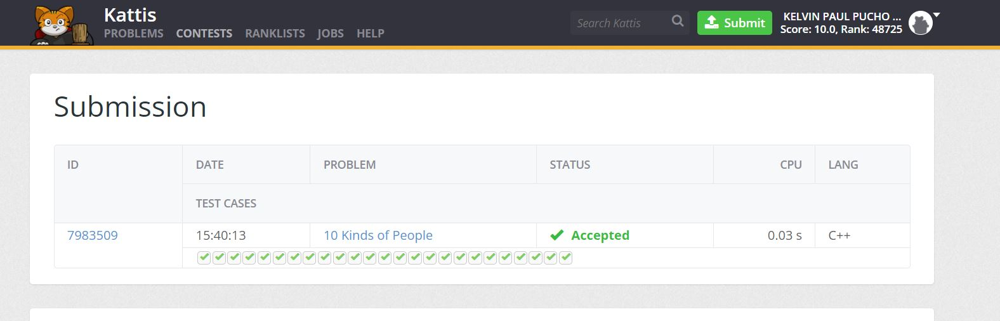
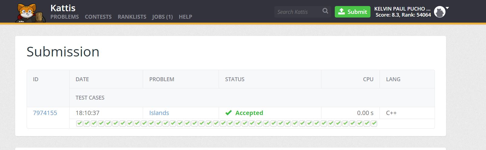
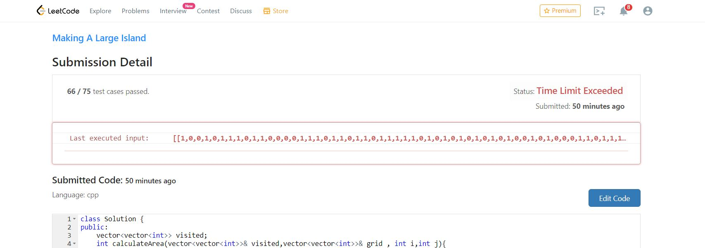
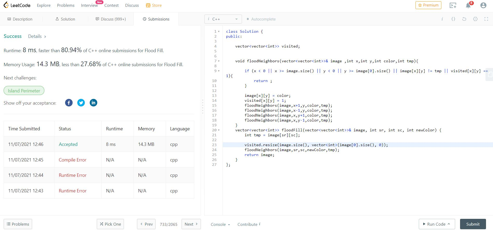
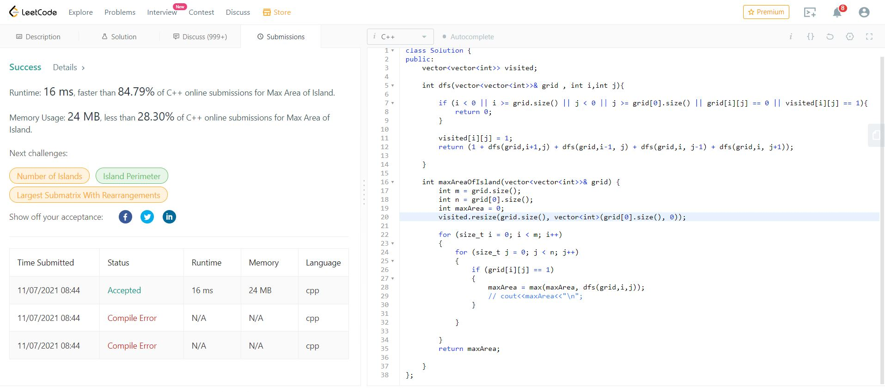
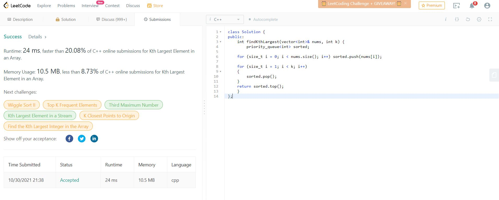
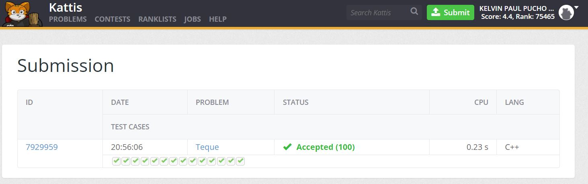
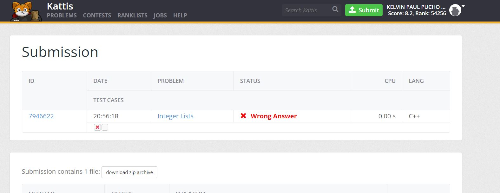
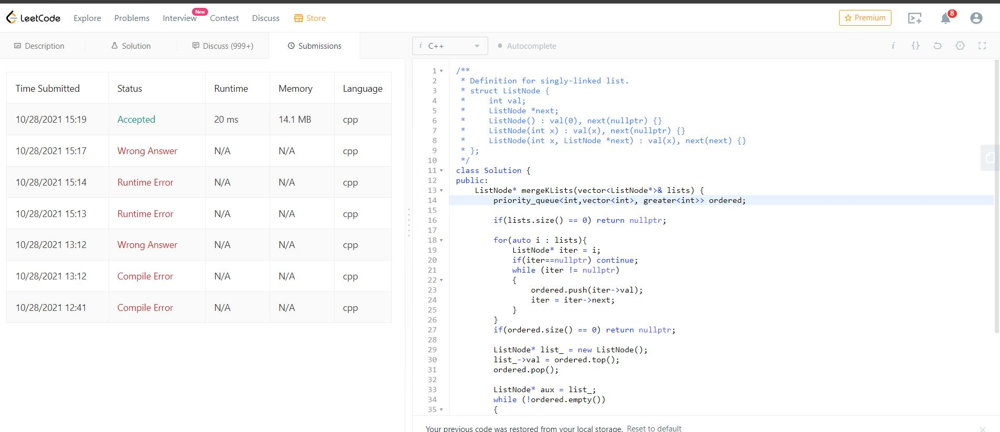
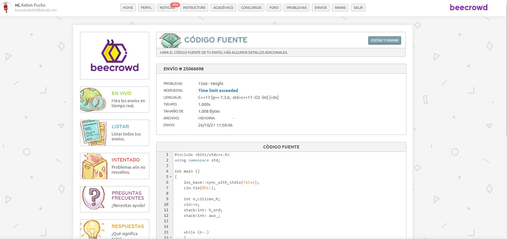

 <div id="top"></div>
<!--
*** Thanks for checking out the Best-README-Template. If you have a suggestion
*** that would make this better, please fork the repo and create a pull request
*** or simply open an issue with the tag "enhancement".
*** Don't forget to give the project a star!
*** Thanks again! Now go create something AMAZING! :D
-->


<!-- PROJECT SHIELDS -->
<!--
*** I'm using markdown "reference style" links for readability.
*** Reference links are enclosed in brackets [ ] instead of parentheses ( ).
*** See the bottom of this document for the declaration of the reference variables
*** for contributors-url, forks-url, etc. This is an optional, concise syntax you may use.
*** https://www.markdownguide.org/basic-syntax/#reference-style-links
-->


# Programación Competitiva

## Ejercicios_18-11-2021 (PRACTICA CALIFICADA)


* Asteroid Collision
  ```cpp     
    #include <bits/stdc++.h>
    using namespace std;

    vector<int> asteroidCollision(vector<int>& asteroids) {
        
        stack<int> survive;
        //larger_asteroids.push_back(asteroids[0]);

        for(size_t i=0 ; i<asteroids.size() ; i++){
            int asteroid = asteroids[i];
            
            if (survive.empty()) {survive.push(asteroid); continue;};
        
            bool isDestroy = false;
            while (!survive.empty() && survive.top() > 0 && asteroid < 0)
            {
                if (survive.top() < abs(asteroid))
                {
                    survive.pop();
                }else if (survive.top() == abs(asteroid))
                {
                    survive.pop();
                    isDestroy = true;
                    break;
                }else
                {
                    isDestroy = true;
                    break;
                }
                
            }
            
            if(isDestroy) continue;
            survive.push(asteroid);
        }

        vector<int> larger_asteroids(survive.size());
        for (int j = survive.size()-1; j >= 0; j--)
        {
            larger_asteroids[j] = survive.top();
            survive.pop();
        }
            
        return larger_asteroids;
    }

    int main ()
    {   
        ios_base::sync_with_stdio(false);
        cin.tie(NULL);
        
        int n;
        cin>>n;
        vector<int> asteroids(n);

        for (size_t i = 0; i < n; i++) cin>>asteroids[i];

        vector<int> ast = asteroidCollision(asteroids);
        for (size_t i = 0; i < ast.size(); i++) cout << ast[i]<<" ";
        cout<<"\n";
        return 0;
        
    }
    ```

<p align="right">(<a href="https://github.com/kpzaolod6000/Programacion_Competitiva/tree/main/ejercicios_18-11-2021/AsteroidCollision.cpp">code link</a>)</p>

### LeetCode screenshots

<div>

</div>


## Ejercicios_15-11-2021

* LCS Bottom Up
  ```cpp     
    int LCS_bottomup(string& P,string& Q){
    int m = P.size();
    int n = Q.size();
    vector<vector<int>> memo(m+1,vector<int>(n+1,0));
    
    
    for (size_t i = 0; i <= m; i++)
    {
        for (size_t j = 0; j <= n; j++)
        {
            if (i == 0 || j == 0)
            {
                memo[i][j] = 0;
            }
            else if(P[i-1] == Q[j-1]){
                // cout<<str1<<" "<<str2<<"\n";
                memo[i][j] = 1 + memo[i-1][j-1];
            }else{
                int a = memo[i-1][j];
                int b = memo[i][j-1];
                memo[i][j] = max(a,b);
            }
        }
        
    }
    return memo[m][n];
    }

    ```

<p align="right">(<a href="https://github.com/kpzaolod6000/Programacion_Competitiva/tree/main/ejercicios_15-11-2021/LongestCommonSubsequence.cpp">code link</a>)</p>

* LCS Memorization
  ```cpp
        
    int LCS_memo(string& P,string& Q,int m, int n, vector<vector<int>>& memo){
        
        int result ;
        if (m == 0 || n == 0)
        {
            result = 0;
        }
        else if (memo[m][n])
        {
            result = memo[m][n];
        }
        
        else if(P[m-1] == Q[n-1]){
            // cout<<str1<<" "<<str2<<"\n";
            result = 1 + LCS_memo(P,Q,m-1,n-1, memo);
        }else{
            int a = LCS_memo(P,Q,m-1,n, memo);
            int b = LCS_memo(P,Q,m,n-1, memo);
            result = max(a,b);
        }
        return result;
    }
    ```

<p align="right">(<a href="https://github.com/kpzaolod6000/Programacion_Competitiva/tree/main/ejercicios_15-11-2021/LongestCommonSubsequence.cpp">code link</a>)</p>


* LCS Recursive
  ```cpp
    int LCS_fib(string P,string Q){
        int result ;

        string strP = P.substr(0,P.size()-1);
        string strQ = Q.substr(0,Q.size()-1);
        if (P.size() == 0 || Q.size() == 0)
        {
            // cout<<P;
            result = 0;
        }
        
        else if(P[P.size()-1] == Q[Q.size()-1]){
            // cout<<str1<<" "<<str2<<"\n";
            result = 1 + LCS_fib(strP,strQ);
        }else{
            int a = LCS_fib(strP,Q);
            int b = LCS_fib(P,strQ);
            result = max(a,b);
        }
        return result;
    }
    ```

<p align="right">(<a href="https://github.com/kpzaolod6000/Programacion_Competitiva/tree/main/ejercicios_15-11-2021/LongestCommonSubsequence.cpp">code link</a>)</p>


## Ejercicios_08-11-2021

* Knapsack BottomUp
  ```cpp
    #include <bits/stdc++.h>
    using namespace std;

    int knapsack_Bottomup(int n,int C,vector<int>& weight,vector<int>& value){
        
        int default_value = 0;
        vector<int> col_(C+1,default_value);
        vector<vector<int>> memo(n+1,col_);

        for (size_t i = 1; i <= n; i++)
        {
            for (size_t j = 1; j <= C; j++)
            {
                if(weight[i] > j){
                    memo[i][j] = memo[i-1][j];
                }else
                {
                    int temp1 = memo[i-1][j];
                    int temp2 = value[i] + memo[i-1][j-weight[i]];
                    memo[i][j]= max(temp1,temp2);
                }
                
            }
            
        }
        return memo[n][C];
        
    }


    int main(int argc, char const * argv[]){
        ios_base::sync_with_stdio(false);
        cin.tie(NULL);

        int n,C;
        cin>>n>>C;

        vector<int> weight(n+1);
        weight[0] = 0;
        for (size_t i = 1; i < n+1; i++) cin>>weight[i];
        
        vector<int> value(n);
        value[0] = 0;
        for (size_t i = 1; i < n+1; i++) cin>>value[i];
        

        cout<<knapsack_Bottomup(n,C,weight,value)<<"\n";
        return 0;
    }

    ```

<p align="right">(<a href="https://github.com/kpzaolod6000/Programacion_Competitiva/tree/main/ejercicios_08-11-2021/knapsackBottomUp.cpp">code link</a>)</p>


* Knapsack Memorization
  ```cpp
    #include <bits/stdc++.h>
    using namespace std;


    int knapsack(int n,int C,vector<int>& weight,vector<int>& value,vector<vector<int>>& memo){

        int result;
        if (memo[n][C])
        {
            result = memo[n][C];
        }
        
        if(n == 0 || C == 0){
            //caso base
            result = 0;
        }
        else if(weight[n] > C){
            result = knapsack(n-1,C,weight,value,memo);
        }else
        {
            int temp1 = knapsack(n-1,C,weight,value,memo);
            int temp2 = value[n]+knapsack(n-1,C-weight[n],weight,value,memo);

            result = max(temp1,temp2);
        }
        memo[n][C] = result;
        return result;
    }

    int knapsack_Memorization(int n,int C,vector<int>& weight,vector<int>& value){
        
        int default_value = 0;
        vector<int> col_(C+1,default_value);
        vector<vector<int>> memo(n+1,col_);


        return knapsack(n,C,weight,value,memo);
        

    }


    int main(int argc, char const * argv[]){
        ios_base::sync_with_stdio(false);
        cin.tie(NULL);

        int n,C;
        cin>>n>>C;

        vector<int> weight(n+1);
        weight[0] = 0;
        for (size_t i = 1; i < n+1; i++) cin>>weight[i];
        
        vector<int> value(n);
        value[0] = 0;
        for (size_t i = 1; i < n+1; i++) cin>>value[i];

        cout<<knapsack_Memorization(n,C,weight,value)<<"\n";
        return 0;
    }

    ```

<p align="right">(<a href="https://github.com/kpzaolod6000/Programacion_Competitiva/tree/main/ejercicios_08-11-2021/knapsackMemorization.cpp">code link</a>)</p>


* Knapsack Recursive
  ```cpp
   
    #include <bits/stdc++.h>
    using namespace std;


    int knapsack(int n,int C,vector<int>& weight,vector<int>& value){

        int result;
        if(n == 0 || C == 0){
            //caso base
            result = 0;
        }
        else if(weight[n] > C){
            result = knapsack(n-1,C,weight,value);
        }else
        {
            int temp1 = knapsack(n-1,C,weight,value);
            int temp2 = value[n]+knapsack(n-1,C-weight[n],weight,value);

            result = max(temp1,temp2);
        }
        return result;
    }

    int main(int argc, char const * argv[]){
        ios_base::sync_with_stdio(false);
        cin.tie(NULL);

        int n,C;
        cin>>n>>C;

        vector<int> weight(n+1);
        weight[0] = 0;
        for (size_t i = 1; i < n+1; i++) cin>>weight[i];
        
        vector<int> value(n);
        value[0] = 0;
        for (size_t i = 1; i < n+1; i++) cin>>value[i];
        
        cout<<knapsack(n,C,weight,value)<<"\n";
        return 0;
    }
    ```

<p align="right">(<a href="https://github.com/kpzaolod6000/Programacion_Competitiva/tree/main/ejercicios_08-11-2021/knapsackRecursive.cpp">code link</a>)</p>


* Fibonacci Memorization
  ```cpp
    
    long fib(int n, vector<long>& memo){
        if(memo[n]){/*cout <<memo[n]<<"\n";*/ return memo[n];}
        long result{};
        if(n<=1)
            result = n;
        else
            result = fib(n-2,memo) + fib(n-1,memo);
        memo[n] = result;
        return result;
    }


    long fib_memorization(int n){
        vector<long> memo(n+1);
        return fib(n,memo);
    }
    ```

<p align="right">(<a href="https://github.com/kpzaolod6000/Programacion_Competitiva/tree/main/ejercicios_08-11-2021/fibMemorization.cpp">code link</a>)</p>


* Fibonacci Bottom Up
  ```cpp
    long fib_bottomup(int n){
        if(n<=1)
            return n;
        vector<long> F(n+1);
        F[0] = 0;
        F[1] = 1;
        for (size_t i = 2; i <= n; i++)
        {
            F[i] = F[i-2] + F[i-1];
        }
        return F[n];
    }
    ```

<p align="right">(<a href="https://github.com/kpzaolod6000/Programacion_Competitiva/tree/main/ejercicios_08-11-2021/fibBottom_up.cpp">code link</a>)</p>


## Ejercicios_04-11-2021

### Breadth First Search
* Complejidad O(n^2)
  ```cpp
    #include <bits/stdc++.h>
    using namespace std;

    void BreadthFirstSearch(vector<vector<int>>& grid,int i, int j){
        
        int n = grid.size();
        int m = grid[0].size();
        
        
        vector<int> posX ={-1, 0, 1, 0}; 
        vector<int> posY ={0, -1, 0, 1};

        grid[i][j] = 0;

        queue<pair<int,int>> search{};
        search.push({i,j});
        
        while (!search.empty()) {
            
            pair<int,int> current = search.front();
            search.pop();
            int r = current.first;
            int c = current.second;

            for (size_t k = 0; k < 4; k++) {
                
                int ir = r + posX[k];
                int jc = c + posY[k];
                
                if ( (ir >= 0 && ir < n && jc >= 0 && jc < m) && grid[ir][jc] == -1){
                    grid[ir][jc] = grid[r][c] + 1;
                    search.push({ir,jc});
                }
            }
        }
        
    }


    int main(int argc, char const * argv[]){
        ios_base::sync_with_stdio(false);
        cin.tie(NULL);


        vector<vector<int>> grid_ = {   {-1,-1,-1,-1,-1},
                                        {-1,-1,-1,-1,-1},
                                        {-1,-1,-1,-1,-1},
                                        {-1,-1,-1,-1,-1},
                                        {-1,-1,-1,-1,-1}};

        BreadthFirstSearch(grid_,1,2);

        for (size_t i = 0; i < grid_.size(); i++)
        {
            for (size_t j = 0; j < grid_[0].size(); j++)
            {
                cout<<grid_[i][j]<<" ";
            }
            cout<<"\n";
        }
        
        return 0;
    }

    ```

<p align="right">(<a href="https://github.com/kpzaolod6000/Programacion_Competitiva/tree/main/ejercicios_04-11-2021/BreadthFirstSearch.cpp">code link</a>)</p>


### 10 Kinds of People
* Complejidad O(n^2)
  ```cpp
    #include <bits/stdc++.h>
    using namespace std;

    int main()
    {
        int r,c;
        cin>>r>>c;
        
        char map[r][c+1];
        
        for (int i = 0; i < r; i++) scanf("%s", map[i]);
        
        int total = r * c;
        int next_group = 1;
        int *group = (int*)calloc((size_t)total, sizeof(int));
        short one = 1;

        stack<pair<int,int>> open{};


        int q;
        cin>>q;
        

        while (q--)
        {
            short r1,c1,r2,c2;
            cin>>r1>>c1>>r2>>c2;
            r1--; c1--; r2--; c2--;
            int dim_one_1 = r1 * c + c1;
            int dim_one_2 = r2 * c + c2;

            if (dim_one_1 == dim_one_2){
                if (map[r1][c1] == '1')
                {
                    cout<<"decimal\n";
                }else{
                    cout<<"binary\n";
                }
                
            }
            else if (group[dim_one_1] == 0 && group[dim_one_2] == 0)
            {
                // DFS
                open.push({r1,c1});
                while (!open.empty())
                {
                    pair<int,int> current = open.top();
                    open.pop();
                    short curr_x = current.first;
                    short curr_y = current.second;
                    char curr_val = map[curr_x][curr_y];
                    int dim_one = curr_x * c + curr_y;
                    if (group[dim_one]) continue;
                    group[dim_one] = next_group;
                    if (curr_x > 0 && map[curr_x-1][curr_y] == curr_val && !group[(curr_x-1)*c+curr_y]) open.push({curr_x-one, curr_y});
                    if (curr_x < r - 1 && map[curr_x+1][curr_y] == curr_val && !group[(curr_x+1)*c+curr_y]) open.push({curr_x+one, curr_y});
                    if (curr_y > 0 && map[curr_x][curr_y-1] == curr_val && !group[curr_x*c+curr_y-1]) open.push({curr_x, curr_y-one});
                    if (curr_y < c - 1 && map[curr_x][curr_y+1] == curr_val && !group[curr_x*c+curr_y+1]) open.push({curr_x, curr_y+one});
                }
                next_group++;
                printf(group[dim_one_2] ? (map[r1][c1] == '1' ? "decimal\n" : "binary\n") : ("neither\n"));
            }
            else if (map[r1][c1] != map[r2][c2]) printf("neither\n");
            else if (group[dim_one_1] == group[dim_one_2]) printf(map[r1][c1] == '1' ? "decimal\n" : "binary\n");
            else printf("neither\n");
        }

        return 0;
    }

    ```

<p align="right">(<a href="https://github.com/kpzaolod6000/Programacion_Competitiva/tree/main/ejercicios_04-11-2021/10KindsofPeople.cpp">code link</a>)</p>


### Open Kattis screenshots

<div>

</div>


## Ejercicios_03-11-2021


### Island
* Complejidad O(n^2)
  ```cpp
    #include <bits/stdc++.h>
    using namespace std;


    vector<vector<int>> visited;
    int calculateArea(vector<vector<char>>& grid , int i,int j){ 

        if (i < 0 || i >= grid.size() || j < 0 || j >= grid[0].size() || grid[i][j] == 'W' || visited[i][j] == 1){
            return 0;
        }

        visited[i][j] = 1;
        return (1 + calculateArea(grid,i+1,j) + calculateArea(grid,i-1, j) + calculateArea(grid,i, j-1) + calculateArea(grid,i, j+1));

    }

    int Island(vector<vector<char>>& grid){

        int m = grid.size();
        int n = grid[0].size();
        int cntIsland = 0;
        bool hasEarth = false;

        for (size_t i = 0; i < m; i++)
        {
            for (size_t j = 0; j < n; j++)
            {
                if (grid[i][j] == 'L')
                {
                    hasEarth = true;
                    if (calculateArea(grid,i,j) != 0)
                    {
                        for (size_t i = 0; i < visited.size(); i++)
                        {
                            for (size_t j = 0; j < visited[i].size(); j++)
                            {
                                cout<<visited[i][j]<<" ";
                            }
                            cout<<"\n";
                        }

                        cntIsland++;
                    }
                }

            }

        }
        return hasEarth ? cntIsland : 0;

    }


    int main(int argc, char const * argv[]){
        ios_base::sync_with_stdio(false);
        cin.tie(NULL);

        int n,m;
        cin>>n>>m;

        vector<vector<char>> grid;
        grid.resize(n, vector<char>(m,' '));

        for (size_t i = 0; i < n; i++)
        {
            for (size_t j = 0; j < m; j++)
            {
                cin>>grid[i][j];
            }
            
        }
        visited.resize(n, vector<int>(m, 0));
        cout<<Island(grid)<<"\n";
        return 0;
    }
    ```

<p align="right">(<a href="https://github.com/kpzaolod6000/Programacion_Competitiva/tree/main/ejercicios_03-11-2021/Island.cpp">code link</a>)</p>


### Open Kattis screenshots

<div>

</div>


### Making A Large Island2
* Complejidad O(n^2)
  ```cpp
  #include <bits/stdc++.h>
    using namespace std;


    vector<vector<int>> visited;
    int calculateArea(vector<vector<int>>& visited,vector<vector<int>>& grid , int i,int j){ 

        if (i < 0 || i >= grid.size() || j < 0 || j >= grid[0].size() || grid[i][j] == 0 || visited[i][j] == 1){
            return 0;
        }

        visited[i][j] = 1;
        return (1 + calculateArea(visited,grid,i+1,j) + calculateArea(visited,grid,i-1, j) + calculateArea(visited,grid,i, j-1) + calculateArea(visited,grid,i, j+1));

    }

    int largestIsland(vector<vector<int>>& grid){

        int m = grid.size();
        int n = grid[0].size();
        int maxArea = 0;
        bool hasZero = false;

        for (size_t i = 0; i < m; i++)
        {
            for (size_t j = 0; j < n; j++)
            {
                if (grid[i][j] == 0)
                {
                    grid[i][j] = 1;
                    hasZero = true;
                    vector<vector<int>> visited;
                    visited.resize(grid.size(), vector<int>(grid[0].size(), 0));
                    maxArea = max(maxArea, calculateArea(visited,grid,i,j));
                    grid[i][j] = 0;
                }

            }

        }
        return hasZero ? maxArea : m*n;

    }


    int main(int argc, char const * argv[]){
        ios_base::sync_with_stdio(false);
        cin.tie(NULL);


        vector<vector<int>> grid_ = {   {0,0,0,0,0,0,0},
                                        {0,1,1,1,1,0,0},
                                        {0,1,0,0,1,0,0},
                                        {1,0,1,0,1,0,0},
                                        {0,1,0,0,1,0,0},
                                        {0,1,0,0,1,0,0},
                                        {0,1,1,1,1,0,0}};

        
        cout<<largestIsland(grid_)<<"\n";
        return 0;
    }
    ```

<p align="right">(<a href="https://github.com/kpzaolod6000/Programacion_Competitiva/tree/main/ejercicios_03-11-2021/MakingALargeIsland2.cpp">code link</a>)</p>


### Leet Code screenshots

<div>

</div>


### Flood Fill

* Complejidad O(n)
  ```cpp
   #include <bits/stdc++.h>
    using namespace std;


    vector<vector<int>> visited;
    

    void floodNeighbors(vector<vector<int>>& image ,int x,int y,int color,int tmp){ 
        
        if (x < 0 || x >= image.size() || y < 0 || y >= image[0].size() || image[x][y] != tmp || visited[x][y] == 1){
            return ;
        }
            
        image[x][y] = color;
        visited[x][y] = 1;
        floodNeighbors(image,x+1,y,color,tmp);
        floodNeighbors(image,x-1,y,color,tmp);
        floodNeighbors(image,x,y+1,color,tmp);
        floodNeighbors(image,x,y-1,color,tmp);
    }

    vector<vector<int>> floodFill(vector<vector<int>>& image, int sr, int sc, int newColor) {
        int tmp = image[sr][sc];
        // image[sr][sc] = newColor;
        floodNeighbors(image,sr,sc,newColor,tmp);
        return image;
    }


    int main(int argc, char const * argv[]){
        ios_base::sync_with_stdio(false);
        cin.tie(NULL);


        // vector<vector<int>> grid_ = {   {0,0,1,1,0,0},
        //                                 {0,0,0,0,0,0},
        //                                 {0,0,0,0,0,0}};

        vector<vector<int>> grid_ = {   {1,1,1},
                                        {1,1,0},
                                        {1,0,1}};
        visited.resize(grid_.size(), vector<int>(grid_[0].size(), 0));//colocar dentro de la funcion en el leetcode OJO

        
        vector<vector<int>> image = floodFill(grid_,1,1,2);

        for(auto row: image){
            for(auto x:row){
                cout<< x <<" ";
            }
            cout<<"\n";
        }
        return 0;
    }
    ```

<p align="right">(<a href="https://github.com/kpzaolod6000/Programacion_Competitiva/tree/main/ejercicios_03-11-2021/FloodFill.cpp">code link</a>)</p>


### Leet Code screenshots

<div>

</div>


### Max Area of Island

* Complejidad O(n)
  ```cpp
    #include <bits/stdc++.h>
    using namespace std;

    vector<vector<int>> visited;

    int dfs(vector<vector<int>>& grid , int i,int j){ 
        
        if (i < 0 || i >= grid.size() || j < 0 || j >= grid[0].size() || grid[i][j] == 0 || visited[i][j] == 1){
            return 0;
        }
            
        visited[i][j] = 1;
        return (1 + dfs(grid,i+1,j) + dfs(grid,i-1, j) + dfs(grid,i, j-1) + dfs(grid,i, j+1));

    }

    int maxAreaOfIsland(vector<vector<int>>& grid){
        int m = grid.size();
        int n = grid[0].size();
        int maxArea = 0;

        for (size_t i = 0; i < m; i++)
        {
            for (size_t j = 0; j < n; j++)
            {
                if (grid[i][j] == 1)
                {
                    maxArea = max(maxArea, dfs(grid,i,j));
                    // cout<<maxArea<<"\n";
                }
                
            }
            
        }
        return maxArea;

    }


    int main(int argc, char const * argv[]){
        ios_base::sync_with_stdio(false);
        cin.tie(NULL);


        // vector<vector<int>> grid_ = {   {0,0,1,1,0,0},
        //                                 {0,0,0,0,0,0},
        //                                 {0,0,0,0,0,0}};

        vector<vector<int>> grid_ = {   {0,0,1,0,0,0,0,1,0,0,0,0,0},
                                        {0,0,0,0,0,0,0,1,1,1,0,0,0},
                                        {0,1,1,0,1,0,0,0,0,0,0,0,0},
                                        {0,1,0,0,1,1,0,0,1,0,1,0,0},
                                        {0,1,0,0,1,1,0,0,1,1,1,0,0},
                                        {0,0,0,0,0,0,0,0,0,0,1,0,0},
                                        {0,0,0,0,0,0,0,1,1,1,0,0,0},
                                        {0,0,0,0,0,0,0,1,1,0,0,0,0}};
        visited.resize(grid_.size(), vector<int>(grid_[0].size(), 0));//colocar dentro de la funcion en el leetcode OJO
        cout<<maxAreaOfIsland(grid_)<<"\n";
        return 0;
    }
    ```

<p align="right">(<a href="https://github.com/kpzaolod6000/Programacion_Competitiva/tree/main/ejercicios_03-11-2021/maxAreaofIsland.cpp">code link</a>)</p>


### Leet Code screenshots

<div>

</div>


## Ejercicios_27-10-2021

### Interview Queue

* Complejidad O(n)
  ```cpp
    #include <bits/stdc++.h>

    using namespace std;

    int main(){

        ios_base::sync_with_stdio(false);
        cin.tie(NULL);

        int n;
        cin>>n;
        vector<int> nums(n);
        for (size_t i = 0; i < n; i++) cin>>nums[i];

        // *************
        vector<vector<int>> result_leaves;
        int g = 0;
        queue<int> leaves;
        vector<int> stay;
        vector<int> aux;

        bool isequal = false;
        while (nums.size() != 1 && isequal == false)
        {
            stay.clear();
            aux.clear();
            
            int prev = nums[0];
            for (size_t i = 1; i < nums.size(); i++)
            {
                if (prev != nums[i]){
                    isequal = false;
                    break;
                }else{
                    isequal = true;
                }
                prev = nums[i];
            }
            
            if (isequal){
                result_leaves.push_back(nums);
                break;
            }
            
            for (size_t i = 0; i < nums.size(); i++)
            {
                
                if (i == 0)
                {
                    if (nums[i] < nums[i+1])
                    {
                        leaves.push(nums[i]);
                        // cout<< nums[i]<<" ";
                    }else
                    {
                        stay.push_back(nums[i]);    
                    }
                    
                }else if ( i == nums.size() - 1){
                    
                    if (nums[i] < nums[i-1])
                    {
                        leaves.push(nums[i]);
                        // cout<< nums[i]<<" ";
                    }else
                    {
                        stay.push_back(nums[i]);    
                    }
                }else{
                    if (nums[i] < nums[i+1] || nums[i] < nums[i-1] )
                    {
                        leaves.push(nums[i]);
                        // cout<<nums[i]<<" ";
                    }else{
                        stay.push_back(nums[i]);
                    }
                    
                }
                
            }
            
            while(!leaves.empty()){
                aux.push_back(leaves.front());
                leaves.pop();
            }
            result_leaves.push_back(aux);
            nums = stay;
            g++;
        }
        // *************
        // InterviewQueue(arr);


        cout<<g<<"\n";
        if (nums.size() == 1)
        {
            result_leaves.push_back(nums);
        }
        

        for(auto arr : result_leaves){
            for(auto x : arr) {
                cout<<x<<" ";
            }
            cout<<"\n";
        }
        return 0;
    }


    ```

<p align="right">(<a href="https://github.com/kpzaolod6000/Programacion_Competitiva/tree/main/ejercicios_27-10-2021/InterviewQueue.cpp">code link</a>)</p>


### Open Kattis screenshots

<div>

</div>


### Kth Largest Element in an Array

* Complejidad O(n)
  ```cpp
  #include <bits/stdc++.h>

    using namespace std;

    int findKthLargest(vector<int>& nums, int k) {
        priority_queue<int> sorted;

        for (size_t i = 0; i < nums.size(); i++) sorted.push(nums[i]);
        
        for (size_t i = 1; i < k; i++)
        {
            sorted.pop();
        }
        return sorted.top();
    }
    int main(){

        ios_base::sync_with_stdio(false);
        cin.tie(NULL);

        int n,k;
        cin>>n>>k;
        vector<int> arr(n);
        for (size_t i = 0; i < n; i++) cin>>arr[i];
        cout<<findKthLargest(arr,k)<<"\n";

        return 0;
    }


    ```

<p align="right">(<a href="https://github.com/kpzaolod6000/Programacion_Competitiva/tree/main/ejercicios_27-10-2021/KthLargestElementinanArray.cpp">code link</a>)</p>


### Leet Code screenshots

<div>

</div>


### Teque

* Complejidad O(n)
  ```cpp
   #include <bits/stdc++.h>

    using namespace std;

    deque<int> left;
    deque<int> right;

    void updateDeques(){
        
        int diff = ::left.size() - ::right.size();
        if (diff < 0) {//if  right is larger than left
            double d = (double)diff / -2;
            for (size_t i = 0; i < ceil(d); i++) {
                ::left.push_back(::right.front());
                ::right.pop_front();
            }
        }
        else if (diff > 1) {//if  left is larger than right
            double d = (double)diff / 2;
            for (size_t i = 0; i < floor(d); i++) {
                ::right.push_front(::left.back());
                ::left.pop_back();
            }
        }
    }

    int main(){

        ios_base::sync_with_stdio(false);
        cin.tie(NULL);

        int queries,val;
        cin>>queries;
        string text;  

        for (size_t i = 0; i < queries; i++)
        {
            cin>>text;
            cin>>val;
            if(text == "push_back"){
                ::right.push_back(val);
                updateDeques();
            }else if(text == "push_front"){
                ::left.push_front(val);
                updateDeques();
            }else if(text == "push_middle"){
                ::left.push_back(val);
                updateDeques();
            }else if(text == "get"){
                if (::left.size() > val){
                    cout << ::left[val] << "\n";
                }
                else{
                    cout << ::right[val - ::left.size()] << "\n";
                }
            }

        }
        return 0;
    }

    ```

<p align="right">(<a href="https://github.com/kpzaolod6000/Programacion_Competitiva/tree/main/ejercicios_27-10-2021/teque.cpp">code link</a>)</p>


### Open Kattis screenshots

<div>

</div>


### Integer Lists

* Complejidad O(n)
  ```cpp
    #include <bits/stdc++.h>
    using namespace std;

    void integerList(string text, vector<int> arr){//stack and queue

        stack<int> elem_inv1;
        deque<int> elem_inv2;

        if (text.size()>arr.size()) {
            cout<<"error"<<endl;
            return ;
        }
        for (size_t i = 0; i < arr.size(); i++) elem_inv2.push_back(arr[i]);
        
        string isStoreIn= "deque";


        for (size_t i = 0; i < text.size(); i++)
        {
            
            if (text[i] == 'R')
            {   
                if (isStoreIn == "stack"){
                    while (!elem_inv1.empty())
                    {
                        elem_inv2.push_front(elem_inv1.top());
                        elem_inv1.pop();
                    }
                    
                    isStoreIn = "deque";

                }else if(isStoreIn == "deque")
                {   
                    while (!elem_inv2.empty())
                    {
                        elem_inv1.push(elem_inv2.front());
                        elem_inv2.pop_front();
                    }
                    isStoreIn = "stack";
                }
                
                
            }else if (text[i] == 'D')
            {
            
                if (isStoreIn == "stack"){
                    elem_inv1.pop();
                    
                }else if(isStoreIn == "deque")
                {
                    elem_inv2.pop_front();
                } 
            }  
        
        }
        // string result = "[";
        if (!elem_inv1.empty())
        {
            while (!elem_inv1.empty())
            {    
                cout<<elem_inv1.top()<<" ";
                elem_inv1.pop();
            }
        }else if(!elem_inv2.empty())
        {
            while (!elem_inv2.empty())
            {
                cout<<elem_inv2.front()<<" ";
                elem_inv2.pop_front();
            }
        }
        cout<<endl;
    
    }
    int main(){

        ios_base::sync_with_stdio(false);
        cin.tie(NULL);

        int q,val,n;
        cin>>q;
        
        while (q--)
        {
            
            string text;
            cin>>text;
            cin>>n;
            vector<int> arr(n);
            for (size_t i = 0; i < n; i++) cin>>arr[i];

            integerList(text, arr);
        
        }
        return 0;
    }

    ```

<p align="right">(<a href="https://github.com/kpzaolod6000/Programacion_Competitiva/tree/main/ejercicios_27-10-2021/IntegerList.cpp">code link</a>)</p>


### Open Kattis screenshots

<div>

</div>

### Merge k Sorted Lists


* Complejidad O(n^2)
  ```cpp
    #include <bits/stdc++.h>
    using namespace std;
    struct ListNode {
        int val;
        ListNode *next;
        ListNode() : val(0), next(nullptr) {}
        ListNode(int x) : val(x), next(nullptr) {}
        ListNode(int x, ListNode *next) : val(x), next(next) {}
        
    };


    ListNode* mergeKLists(vector<ListNode*>& lists) {

        priority_queue<int,vector<int>, greater<int>> ordered; 

        if(lists.size() == 0) return nullptr;
        
        for(auto i : lists){
            ListNode* iter = i;
            if(iter==nullptr) continue;
            while (iter != nullptr)
            {
                ordered.push(iter->val);
                iter = iter->next;
            }
        }
        if(ordered.size() == 0) return nullptr;

        ListNode* list_ = new ListNode();
        list_->val = ordered.top();
        ordered.pop();

        ListNode* aux = list_;
        while (!ordered.empty())
        {
            ListNode* nxt = new ListNode();
            nxt->val = ordered.top();
            aux->next = nxt;
            aux = aux->next;
            ordered.pop();

        }
        return list_;
    }


    int main ()
    {   
        ios_base::sync_with_stdio(false);
        cin.tie(NULL);

        int n, m, num;
        cin>>n;

        vector<ListNode*> list_;
        
        for (size_t i = 0; i < n; i++)
        {
            cin>>m;        
            ListNode *init= new ListNode();
            cin>>num;
            init->val = num;

            ListNode* aux = init;
            
            for (size_t j = 0; j < m-1; j++)
            {
                cin>>num;
                ListNode *newNode = new ListNode();
                newNode->val = num;
                aux->next = newNode;
                aux = aux->next;
            }
            list_.push_back(init);
        }
        
        ListNode* odr = mergeKLists(list_);

        while (odr)
        {
            cout<<odr->val<<" ";
            odr = odr->next;
        }
        

        return 0;
        
    }


    ```

<p align="right">(<a href="https://github.com/kpzaolod6000/Programacion_Competitiva/tree/main/ejercicios_25-10-2021/MergekSortedLists2.cpp">code link</a>)</p>


### Leet Code screenshots

<div>

</div>


## Ejercicios_25-10-2021

### Merge k Sorted Lists

* Complejidad O(n^2)
  ```cpp
    #include <bits/stdc++.h>
    using namespace std;

    priority_queue<int, vector<int>, greater<int>> MergekSortedLists(list<list<int>>& list_){
        
        priority_queue<int, vector<int>, greater<int>> ordered;

        for (auto sub : list_)
        {
            for(auto x : sub){
                ordered.push(x);
            }
        }
        return ordered;
    }

    int main ()
    {   
        ios_base::sync_with_stdio(false);
        cin.tie(NULL);

        int n, m, num;
        cin>>n;

        list<list<int>> list_;
        list<int> sublist;
        
    
        for (int i = 0; i < n; i++) {
    
            // number of elements in list
            cin>>m;
            for (int j = 0; j < m; j++) {
                cin>>num;
                sublist.push_back(num);
            }
    
    
            list_.push_back(sublist);
    
            // delete all elements from single_list
            sublist.erase(sublist.begin(),
                            sublist.end());
        }
        priority_queue<int, vector<int>, greater<int>> ordered = MergekSortedLists(list_);

        while (!ordered.empty())
        {
            cout<<ordered.top()<<" ";
            ordered.pop();
        }
        cout<<"\n";

        return 0;
        
    }
    ```

<p align="right">(<a href="https://github.com/kpzaolod6000/Programacion_Competitiva/tree/main/ejercicios_25-10-2021/MergekSortedLists.cpp">code link</a>)</p>


### interviewWait


* Complejidad O(n)
  ```cpp
    #include <bits/stdc++.h>
    using namespace std;

    int interviewWait(vector<int>& timeWait) {
        deque<char> timeW;
        int left,right;
        for(int i = 0; i < timeWait.size(); i++) timeW.push_back(timeWait[i]);
        int interTime = 0;

        for (size_t i = 0; i < timeW.size(); i++)
        {
            left = timeW.front();
            right = timeW.back();
            int minTime = min(left,right);
            if (minTime != -1)
            {
                if (minTime == left) timeW.pop_front();
                else if (minTime == right) timeW.pop_back();
                interTime += minTime;
            }else return interTime;
        }
        
        return interTime;
    }

    int main ()
    {   
        ios_base::sync_with_stdio(false);
        cin.tie(NULL);

        int n;
        cin>>n;
        vector<int> timeWait(n);
        for (int i = 0; i < n; i++) cin>>timeWait[i];
        cout<<interviewWait(timeWait)<<"\n";

        return 0;
        
    }
    ```

<p align="right">(<a href="https://github.com/kpzaolod6000/Programacion_Competitiva/tree/main/ejercicios_25-10-2021/interviewWait.cpp">code link</a>)</p>


### Backspace

* Complejidad O(n)
  ```cpp
    #include <bits/stdc++.h>
    using namespace std;

    deque<char> Backspace(string& S) {
        deque<char> t;
        char ch;

        for (size_t i = 0; i < S.size(); i++)
        {
            ch = S[i];
            if (ch != '#')
            {
                t.push_back(ch);
            }else{
                t.pop_back();
            }
            
        }

        return t;
    }

    int main ()
    {   
        ios_base::sync_with_stdio(false);
        cin.tie(NULL);

        string text = "abc#de##f#ghi#jklmn#op#";
        
        
        deque<char> mydeque= Backspace(text);
        while (!mydeque.empty())
        {
            cout << mydeque.front();
            mydeque.pop_front();
        }
        cout<<"\n";
        return 0;
        
    }


    ```

<p align="right">(<a href="https://github.com/kpzaolod6000/Programacion_Competitiva/tree/main/ejercicios_25-10-2021/Backspace.cpp">code link</a>)</p>


### CapsLock

* Complejidad O(n)
  ```cpp
    #include <bits/stdc++.h>
    using namespace std;

    string CapsLock(string text) {
        string result = "";
        queue<char> buffer;
        bool isEnable = false;
        for (size_t i = 0; i < text.size(); i++)
        {
            if (text[i] == '$')
            {
                while (!buffer.empty())
                {
                    result += buffer.front();
                    buffer.pop();
                }
                
            }else if (text[i] == '@'){

                for (size_t x = 0; x < text.size(); x++)
                {
                    buffer.push(toupper(buffer.front()));
                    buffer.pop();
                }
                
                isEnable = isEnable == true ? false : true;
            }else{
                if (isEnable) buffer.push(toupper(text[i]));
                else buffer.push(text[i]);
            }
            
        }
        


        return result;
    }

    int main ()
    {   
        ios_base::sync_with_stdio(false);
        cin.tie(NULL);

        string text;
        cin>>text;
        
        
        // for(auto x : H) cout<<x<<" ";
        cout<<CapsLock(text)<<"\n";
        return 0;
        
    }

    ```

<p align="right">(<a href="https://github.com/kpzaolod6000/Programacion_Competitiva/tree/main/ejercicios_25-10-2021/capsLock.cpp">code link</a>)</p>


## Ejercicios_21-10-2021

### Height

* Complejidad O(n*m)
  ```cpp
   #include <bits/stdc++.h>
    using namespace std;

    int main ()
    {   
        ios_base::sync_with_stdio(false);
        cin.tie(NULL);
        
        int n,citizen,h;
        cin>>n;
        stack<int> h_ord;
        stack<int> aux_;
        

        while (n--)
        {
            cin>>citizen;
            
            while (citizen--)
            {
                cin>>h;
                if (h_ord.empty()) h_ord.push(h);
                else
                {   
                    while (!h_ord.empty() && h > h_ord.top())
                    {
                        
                        aux_.push(h_ord.top());
                        h_ord.pop();
                    }
                    h_ord.push(h);
                    while (!aux_.empty())
                    {
                        h_ord.push(aux_.top());
                        aux_.pop();
                    }
                }
            }
            while (!h_ord.empty())
            {
                cout<<h_ord.top()<<" ";
                h_ord.pop();
            }
            cout<<"\n";
        }
        
        return 0;
        
    }

    ```

<p align="right">(<a href="https://github.com/kpzaolod6000/Programacion_Competitiva/tree/main/ejercicios_21-10-2021/Height.cpp">code link</a>)</p>


### URI Online Judge screenshots

<div>

</div>


### EvenandOdd

* Complejidad O(n)
  ```cpp
    #include <bits/stdc++.h>
    using namespace std;

    int main ()
    {   
        ios_base::sync_with_stdio(false);
        cin.tie(NULL);
        
        priority_queue<int, vector<int>, greater<int> > even;
        priority_queue<int> odd;
    
        int n,val;
        cin>>n;

        for (size_t i = 0; i < n; i++)
        {
            cin>>val;
            // if(numOrder.empty()) numOrder.push(val)
            if (val % 2 == 0 ) even.push(val);
            else odd.push(val);
        }
        while(!even.empty()){
            cout << even.top() << "\n";
            even.pop();
        }
        while(!odd.empty()){
            cout << odd.top() << "\n";
            odd.pop();
        }
        return 0;
        
    }
    ```

<p align="right">(<a href="https://github.com/kpzaolod6000/Programacion_Competitiva/tree/main/ejercicios_21-10-2021/EvenandOdd.cpp">code link</a>)</p>


### URI Online Judge screenshots

<div>

</div>


### infixToSuffix

* Complejidad O(n)
  ```cpp
    #include <bits/stdc++.h>
    using namespace std;


    int prec(char c) {
        if(c == '^')
            return 3;
        else if(c == '/' || c=='*')
            return 2;
        else if(c == '+' || c == '-')
            return 1;
        else
            return -1;
    }

    int main ()
    {   
        ios_base::sync_with_stdio(false);
        cin.tie(NULL);
        
        int n;
        cin>>n;

        
        while (n>0)
        {
            string text;
            cin>>text;
            // for(auto x : infixToSuffix(text)) cout<<x;
            // cout<<"\n";

            string result = "";
            stack<char> operator_;
            char ch;

            for (size_t i = 0; i < text.size(); i++)
            {
                ch = text[i];
                if (isalnum(ch))
                {
                    // cout << ch<<"$\n";
                    result += ch;
                }
                else if (ch == '(') operator_.push('(');
                else if (ch == ')') {
                    while(operator_.top() != '(')
                    {
                        result += operator_.top();
                        operator_.pop();
                    }
                    operator_.pop();//retirando "("
                }
                else{
                    if (!operator_.empty())
                    {
                        while(!operator_.empty() && prec(ch) <= prec(operator_.top())) {
                            result += operator_.top();
                            operator_.pop();
                        }
                        operator_.push(ch);
                    }else operator_.push(ch);
                    
                }
            }
            while(!operator_.empty()) {
                result += operator_.top();
                operator_.pop();
            }

            cout << result << "\n";

            n--; 
        }

        return 0;
        
    }
    ```

<p align="right">(<a href="https://github.com/kpzaolod6000/Programacion_Competitiva/tree/main/ejercicios_21-10-2021/infixToSuffix.cpp">code link</a>)</p>


### URI Online Judge screenshots

<div>

</div>


### StoneWall

* Complejidad O(n)
  ```cpp
   #include <bits/stdc++.h>
    using namespace std;

    int stoneWall(vector<int>& H){
        stack<int> height;
        int cntBlock = 0;
        
        for (size_t i = 0; i < H.size(); i++)
        {
            while (!height.empty() && height.top()>H[i] ) height.pop();
            if (height.empty())
            {
                cntBlock++;
                height.push(H[i]);
            }
            else if(height.top() == H[i]){;}
            else if(height.top() < H[i]){
                cntBlock++;
                height.push(H[i]);
            }
        }
        return cntBlock;
    }

    int main ()
    {   
        ios_base::sync_with_stdio(false);
        cin.tie(NULL);

        int n;    
        cin>>n;
        vector<int> H(n);

        for (size_t i = 0; i < n; i++) cin>>H[i];
        
        // for(auto x : H) cout<<x<<" ";

        cout<<stoneWall(H)<<"\n";
        return 0;
        
    }
    ```

<p align="right">(<a href="https://github.com/kpzaolod6000/Programacion_Competitiva/tree/main/ejercicios_21-10-2021/StoneWall.cpp">code link</a>)</p>


### Codility screenshots

<div>


</div>


### Nesting

* Complejidad O(n)
  ```cpp
    #include <bits/stdc++.h>
    using namespace std;

    int nesting(string& S){
        stack<int> parenth;
        char ch;
        for (size_t i = 0; i < S.size(); i++)
        {
            ch = S[i];
            if (ch == '(') parenth.push('(');
            else
            {
                if(parenth.empty() || parenth.top() != '(') return 0;
                else parenth.pop();
            }
        }
        return parenth.size() > 0 ? 0 : 1;
    }

    int main ()
    {   
        ios_base::sync_with_stdio(false);
        cin.tie(NULL);
        
        string text;
        getline(cin, text);

        cout<<nesting(text)<<"\n";
        return 0;
        
    }
    ```

<p align="right">(<a href="https://github.com/kpzaolod6000/Programacion_Competitiva/tree/main/ejercicios_21-10-2021/Nesting.cpp">code link</a>)</p>


### Codility screenshots

<div>


</div>


### Fish

* Complejidad O(n)
  ```cpp
    #include <bits/stdc++.h>
    using namespace std;
    int fish(vector<int>& A,vector<int>& B){
        if (A.size() == 0) return 0;
        
        stack<int> fishDepretator;
        int fishLive = A.size();
        for (size_t i = 0; i < A.size(); i++)
        {
            if(B[i] == 1){
                fishDepretator.push(A[i]);
            }
            else //B[i] == 0
            {
                while (!fishDepretator.empty())
                {
                    if (fishDepretator.top() > A[i])
                    {
                        fishLive--;
                        break;
                    }else if (fishDepretator.top()<A[i]){
                        fishLive--;
                        fishDepretator.pop();
                    }
                    
                }
                
            }
        }
        return fishLive;
    }

    int main ()
    {   
        ios_base::sync_with_stdio(false);
        cin.tie(NULL);
        
        int n;
        cin>>n;
        vector<int> A(n);
        vector<int> B(n);
        for (size_t i = 0; i < n; i++) cin>>A[i];
        for (size_t i = 0; i < n; i++) cin>>B[i];
        
        cout<<fish(A,B)<<"\n";
        return 0;
        
    }
    ```

<p align="right">(<a href="https://github.com/kpzaolod6000/Programacion_Competitiva/tree/main/ejercicios_21-10-2021/Fish.cpp">code link</a>)</p>


### Codility screenshots

<div>


</div>


### Brackets

* Complejidad O(n)
  ```cpp
    #include <bits/stdc++.h>
    using namespace std;

    int brackets(string& S){
        
        stack<int> N_oper;
        char ch;
        if (S.empty()) return 1;

        for (size_t i = 0; i < S.size(); i++)
        { 
            switch (S[i]){
                case '(':
                    N_oper.push(')');
                    break;
                case '[':
                    N_oper.push(']');
                    break;
                case '{':
                    N_oper.push('}');
                    break;
                default:
                    if (N_oper.empty()) return 0;
                    else
                    {
                        ch = S[i];
                        if (ch != N_oper.top()) return 0;
                        N_oper.pop();
                    }
                    break;
            }
        }

        return N_oper.size() > 0 ? 0 : 1;
    }

    int main ()
    {   
        ios_base::sync_with_stdio(false);
        cin.tie(NULL);
        
        // int n;
        // cin>>n;

        string text;
        getline(cin, text);

        // cout<<text<<"\n";
        
        cout<<brackets(text)<<"\n";
        return 0;
        
    }


    ```

<p align="right">(<a href="https://github.com/kpzaolod6000/Programacion_Competitiva/tree/main/ejercicios_21-10-2021/brackets.cpp">code link</a>)</p>


### Codility screenshots

<div>


</div>


## Ejercicios_20-10-2021

### Evaluate Reverse Polish Notation

* Complejidad O(n)
  ```cpp
    #include <bits/stdc++.h>
    using namespace std;


    int evalRPN(vector<string>& tokens){
        stack<int> result;
        int x_val,y_val;

        for (size_t i = 0; i < tokens.size(); i++)
        {
            string ch = tokens[i];
            if( ch=="+" || ch=="-" || ch=="*" || ch=="/"){
                y_val = result.top();
                result.pop();
                x_val = result.top();
                result.pop();
                if (ch == "+") result.push(x_val + y_val);
                else if (ch == "-") result.push(x_val - y_val);
                else if (ch == "*") result.push(x_val * y_val);
                else if (ch == "/") result.push(x_val / y_val);
            }else{
                result.push(stoi(ch));
            }
        }
        return result.top();
        
    }

    int main(){
        ios_base::sync_with_stdio(false);
        cin.tie(NULL);
    
        
        vector<string> arr ={"2","1","+","3","*"};
        cout<<evalRPN(arr)<<"\n";
        
        vector<string> arr2 ={"10","6","9","3","+","-11","*","/","*","17","+","5","+"};
        cout<<evalRPN(arr2)<<"\n";
        
        return 0;
    }
    ```

<p align="right">(<a href="https://github.com/kpzaolod6000/Programacion_Competitiva/tree/main/ejercicios_20-10-2021/EvaluateReversePolishNotation.cpp">code link</a>)</p>


### LeetCode screenshots

<div>

</div>

### Minimum Add to Make Parentheses Valid


* Complejidad O(n)
  ```cpp
    #include <bits/stdc++.h>
    using namespace std;

    int minAddToMakeValid(string s) {
        stack<char> parenth;
        parenth.push(s[0]);
        
        for (size_t i = 1; i < s.size(); i++)
        {
            char ch = s[i];
            if(parenth.empty()) parenth.push(ch);
            else 
            {
                char ins = parenth.top();
                
                if (ins == ch || ch < ins) parenth.push(ch);
                else parenth.pop();
            }
                
        }
        return parenth.size();
        
    }

    int main ()
    {   
        ios_base::sync_with_stdio(false);
        cin.tie(NULL);
        
        
        string arr = "())";
        cout<<minAddToMakeValid(arr)<<"\n";
        
        string arr2 ="()))((";
        cout<<minAddToMakeValid(arr2)<<"\n";
        
        return 0;

    }
    ```

<p align="right">(<a href="https://github.com/kpzaolod6000/Programacion_Competitiva/tree/main/ejercicios_20-10-2021/MinimumAddtoMakeParenthesesValid.cpp">code link</a>)</p>

### LeetCode screenshots

<div>

</div>


### Score of Parentheses

* Complejidad O(n)
  ```cpp
    #include <bits/stdc++.h>
    using namespace std;

    int score_OfParentheses(string s) {
        
        stack<int> parenthBalanced;
        int score_ = 0;
        char ch;
        
        for (size_t i = 0; i < s.size(); i++)
        {
            ch = s[i];
            if (ch == '(')
            {
                parenthBalanced.push(score_);
                score_ = 0;
            }else{
                score_ = parenthBalanced.top() + max(score_*2,1);
                parenthBalanced.pop();
            }
        }

        return score_;

        
    }

    int main ()
    {   
        ios_base::sync_with_stdio(false);
        cin.tie(NULL);
        
        string arr ="()()";
        cout<<score_OfParentheses(arr)<<"\n";

        string arr2 ="(()(()))";
        cout<<score_OfParentheses(arr2)<<"\n";

        return 0;

    }
    ```

<p align="right">(<a href="https://github.com/kpzaolod6000/Programacion_Competitiva/tree/main/ejercicios_20-10-2021/scoreOfParentheses.cpp">code link</a>)</p>


### LeetCode screenshots

<div>

</div>

## Ejercicios_18-10-2021

### Disastrous Downtime


* Complejidad O(n)
  ```cpp
    #include <bits/stdc++.h>
    using namespace std;

    vector<int> sums(vector<int> arr){
    
        vector<int> aux;
        aux.push_back(arr[0]);
        for (size_t i = 1; i < arr.size(); i++) aux.push_back(aux.back() + arr[i]);
        return aux;

    }

    int DisastrousDowntime(vector<int> &arr,int k){
        
        int n = arr[arr.size()-1];
        int miliscnd = 1000;
        vector<int> times(n+miliscnd+1);
        
        int time;
        for (size_t i = 0; i < arr.size(); i++)
        {
            time = arr[i];
            times[time]++;
            time += miliscnd;
            times[time]--;
        }
        vector<int> sumTime = sums(times);
        sort (sumTime.begin(), sumTime.end());
        
        return ceil((1.0 * sumTime[sumTime.size() - 1])/k);
        
    }

    int main(){
        ios_base::sync_with_stdio(false);
        cin.tie(NULL);
        
        int n,k;
        cin >> n >>k;

        vector<int> arr(n);
        for (size_t i= 0;i < n; i++) cin>>arr[i];
        cout<<DisastrousDowntime(arr,k);

        cout<<"\n";
        return 0;
    } 
    ```

<p align="right">(<a href="https://github.com/kpzaolod6000/Programacion_Competitiva/tree/main/ejercicios_18-10-2021/DisastrousDowntime.cpp">code link</a>)</p>

### OpenKattis screenshots
<ul>

<li></li>
<li></li>
<li></li>
</ul>

### Haybale Stacking


* Complejidad O(n)
  ```cpp
    #include <bits/stdc++.h>

    using namespace std;

    vector<int> sumsPrefix(vector<int> arr){a
    
        vector<int> aux;
        aux.push_back(0);
        for (size_t i = 0; i < arr.size(); i++) aux.push_back(aux.back() + arr[i]);
        return aux;

    }

    int HaybaleStacking(vector<int> &arr,int k){
        int A,B;
        while (k > 0)
        {
            cin>>A>>B;
            arr[A]++;
            arr[B+1]--;
            k--;
        }
        vector<int> rpt = sumsPrefix(arr);
        sort (rpt.begin(), rpt.end());
   
        return arr[arr.size()/2+1];
    }

    int main(){
        ios_base::sync_with_stdio(false);
        cin.tie(NULL);
    
        int n,k;
        cin >> n >>k;

        vector<int> arr(n);
    
        cout<<HaybaleStacking(arr,k);

        cout<<"\n";
        return 0;
    }

  ```

<p align="right">(<a href="https://github.com/kpzaolod6000/Programacion_Competitiva/tree/main/ejercicios_18-10-2021/HaybaleStacking.cpp">code link</a>)</p>


## EXAMEN PARCIAL 1

### Codigos

| Name                                                           | Solution                   |
| -------------------------------------------------------------- | --------------------------               |
| Min Avg Two Slice                                              | [MinAvgTwoSlice.cpp](./examen%20parcial%20I/MinAvgTwoSlice.cpp) |
| Genomic Range Query                                            | [GenomicRangeQuery.cpp](./examen%20parcial%20I/GenomicRangeQuery.cpp) |
| Maximum Subarray Sum II                                        | [MaximumSubarraySumII.cpp](./examen%20parcial%20I/MaximumSubarraySumII.cpp) |
| Nearest Smaller Values                                        | [NearestSmallerValues.cpp](./examen%20parcial%20I/NearestSmallerValues.cpp) |
| Dynamic Range Sum Queries                                     | [DynamicRangeSumQueries.cpp](./examen%20parcial%20I/DynamicRangeSumQueries.cpp)|
| Palindrome Queries                                           | [PalindromeQueries.cpp](./examen%20parcial%20I/PalindromeQueries.cpp)|
| CODFURY - Megatron and his rage                               | [MegatronAtack.cpp](./examen%20parcial%20I/MegatronAtack.cpp)|


<!-- TABLE OF CONTENTS -->
<details>
  <summary>Lista de Ejercicios</summary>
  <ol>
    <li><a href="#Ejercicios_20-09-2021">Ejercicios_20-09-2021</a></li>
    <li><a href="#Ejercicios_23-09-2021">Ejercicios_23-09-2021</a></li>
    <li><a href="#Ejercicios_27-09-2021">Ejercicios_27-09-2021</a></li>
    <li><a href="#Ejercicios_29-09-2021">Ejercicios_29-09-2021</a></li>
    <li><a href="#Ejercicios_30-09-2021">Ejercicios_30-09-2021</a></li>
  </ol>
</details>


<!-- ABOUT THE PROJECT -->
## Ejercicios_20-09-2021

### Prefix Sums


* Complejidad O(n)
  ```cpp
  vector<int> sumsPrefix(vector<int> arr){
    
    vector<int> aux;
    aux.push_back(0);

    for (size_t i = 0; i < arr.size(); i++) aux.push_back(aux.back() + arr[i]);

    return aux;
  }

  ```

<p align="right">(<a href="#top">back to top</a>)</p>


### Find Pivot

* Complejidad O(n)

  ```cpp
  int findPivot(vector<int> &nums){// complejidad O(n)
    
    int izq = 0, der = 0;
    for(size_t i=0;i<nums.size();i++){
        if(i == 0){
            for(size_t j=i+1;j<nums.size();j++) der += nums[j];
        }else der -= nums[i];
        
        if(izq == der) return i;
        else izq += nums[i];
    }
    return -1;
  }
  ```

<p align="right">(<a href="#top">back to top</a>)</p>


## Ejercicios_23-09-2021

### SubArray Sum

* Complejidad O(n^2)
  ```cpp
  vector<int> sumsPrefix(vector<int> arr){
      vector<int> aux;
      aux.push_back(0);

      for (size_t i = 0; i < arr.size(); i++) aux.push_back(aux.back() + arr[i]);

      return aux;

  }

  int subarraySum(vector<int> &nums,int k){// Complejidad n^2

      vector<int> sum_prfx = sumsPrefix(nums);
      int cnt = 0;

      for(size_t i = 0; i < nums.size(); i++){
          for(size_t j = i; j < nums.size(); j++){
              if((sum_prfx[j+1] - sum_prfx[i]) == k) cnt++;
          }
      }

      return cnt;
  }

  ```

<p align="right">(<a href="#top">back to top</a>)</p>


### SubArray Sum Divisible by K

* Complejidad O(n^3)
  ```cpp
    int subarraysDivByK(vector<int> &nums,int k){// complejidad O(n^3)
      
      int cnt = 0;
      int sums;

      for(size_t i = 0; i < nums.size() ; i++){
          for(size_t j = i; j < nums.size() ; j++){
              sums = 0;
              for(size_t k = i;k < j+1 ; k++){
                  sums += nums[k];
              }
              if(sums % k == 0) cnt++;
          }
      }
      return cnt;
  }
  ```
* Complejidad O(n^2)
  ```cpp
    vector<int> sumsPrefix(vector<int> arr){
      
      vector<int> aux;
      aux.push_back(0);

      for (size_t i = 0; i < arr.size(); i++) aux.push_back(aux.back() + arr[i]);

      return aux;

  }

  int subarraysDivByK(vector<int> &nums,int k){// Complejidad n^2
      
      vector<int> sum_prfx = sumsPrefix(nums);
      int cnt = 0;
      
      for(size_t i = 0; i < nums.size(); i++){
          for(size_t j = i; j < nums.size(); j++){
              if((sum_prfx[j+1] - sum_prfx[i]) % k == 0) cnt++;
          }
      }
      
      return cnt;
  }
  ```

* Complejidad O(n)
  ```cpp
      
  int subarraysDivByK(vector<int> nums,int k){
      map<int,int> indxT;
      map<int,int>::iterator ind;
      int prefix_sum = 0,cnt = 0;
      
      indxT[0] = 1;
      
      int v_=0;
      int mod_k;
      for(size_t i = 0; i < nums.size(); i++){
          
          prefix_sum = (prefix_sum + nums[i]);
          //mod_k = abs(prefix_sum % k);
          mod_k = ((prefix_sum % k) + k) % k;
          
          if(indxT.count(mod_k)){
              ind = indxT.find(mod_k);
              v_ = ind->second;
          }else v_ = 0;
          
          cnt += v_;

          indxT[mod_k] = indxT.find(mod_k)->second+ 1;
      }
      // cout<<"\n";
      //for (map<int,int>::iterator it=indxT.begin(); it!=indxT.end(); ++it){
      //    cout << it->first << " => " << it->second << '\n';
      //} 
      return cnt;
  }
  ```

## Ejercicios_27-09-2021


### Two Pointers

* two Sum: Complejidad O(n)
  ```cpp
    
  vector<int> twoPointerArrayAsc(vector<int> arr,int target){//complejidad n

      vector<int> idx;
      int n = arr.size();
      multimap<int,int> aux;

      int in = 0, en = n-1;

      for(size_t i = 0; i < n ; i++){
          aux.insert ( pair<int,int>(arr[i],i));
      }
      sort(arr.begin(),arr.begin()+n);

      bool isTrue = true;
      while(in < en){
          if (arr[in] + arr[en] < target ) in++;
          else if (arr[in] + arr[en] > target ) en--;
          else break;
      }
      
      if (in == en) {
          isTrue = false;
      }else{
          //cout << in <<" "<<en<<"\n";
          multimap<int,int>::iterator in_idx = aux.find(arr[in]);
          multimap<int,int>::iterator en_idx = aux.find(arr[en]);
          
          if(in_idx == en_idx){

              pair <std::multimap<int,int>::iterator, std::multimap<int,int>::iterator> ret;
              
              ret = aux.equal_range(arr[in]);
              int last_;
              for (multimap<int,int>::iterator it_=ret.first; it_!=ret.second; ++it_)
                  last_ = it_->second;
              
              idx.push_back( ret.first->second+ 1 );
              idx.push_back( last_+1 );
              return idx;
  
          }

          idx.push_back( in_idx->second+1 );
          idx.push_back( en_idx->second+1 );
          return idx;
      }

      if(!isTrue) cout<<"IMPOSSIBLE";
      cout<<"\n";
      
      return idx;
  }
  ```
* three Sum: Complejidad O(n^2)
  ```cpp
    
  vector<int> twoPointer2(vector<int> arr,int target){

    vector<int> idx;
    int n = arr.size();
    map<int,int> aux;

    int in,en,target_fake,sum_;

    for(size_t i = 0; i < n ; i++){
        aux[arr[i]] = i;
    }


    sort(arr.begin(),arr.begin()+n);

    bool isTrue = true;
    for(size_t j = 0; j < n; j++){
        target_fake = target - arr[j];
        in = j+1;
        en = n-1;
        
        while(in < en){
            sum_ = arr[in]+arr[en]; 
            if (sum_ < target_fake ) in++;
            else if (sum_ > target_fake ) en--;
            else break;
        }
    
        if (in == en) isTrue = false; 
        else{
            map<int,int>::iterator j_idx = aux.find(arr[j]);
            map<int,int>::iterator in_idx = aux.find(arr[in]);
            map<int,int>::iterator en_idx = aux.find(arr[en]);

            idx.push_back( j_idx->second );
            idx.push_back( in_idx->second );
            idx.push_back( en_idx->second );
            isTrue = true;
            return idx;
        }

    }
    if(!isTrue) cout << "IMPOSSIBLE\n";
    
    
    return idx;

  }
  ```

<p align="right">(<a href="#top">back to top</a>)</p>


### Square Sorted

* Complejidad O(n^2)
  ```cpp
  void sortedOrder(vector<int> arr,int n){//Complejidad n con k²
      
      int in = 0, en = n-1,temp;
      int a,b;
      int aux[n];
      for (size_t i = 0; i < n; i++)
      {
          aux[i] = abs(arr[i] * arr[i]); 
      }
      

      while (arr[in] < 0)// k veces
      {
          en = n-1;
          while(arr[en] > 0){// k(n-k) veces
              if(aux[in] > aux[en]){
                  temp = aux[in];
                  aux[in] = aux[en];
                  aux[en] = temp;
              }
              en--;
          }
          // break;
          in++;
      }

      for (size_t i = 0; i < n; i++)
      {
          cout << aux[i] <<" ";
      }
  }

  ```

  * Complejidad O(N*log2(N))
  ```cpp
  bool ordSquare(int i,int j){ return(i*i < j*j); }

  void sortOrderSquare(vector<int> &arr){

      sort(arr.begin(), arr.end(), ordSquare); 
  }
  // code inside main function
  for(auto x : arr) cout << x*x <<" ";
    cout<<"\n";

  ```

<p align="right">(<a href="#top">back to top</a>)</p>


## Ejercicios_29-09-2021


### Sliding Windows

* Complejidad O(n^2)
  ```cpp
   int slidingWindow(vector<int> vector_, int n, int k){//complejidad n^2
    
      int max = 0;
      int sum_;
      for (size_t i = 0; i < n-k+1; i++)
      {
          sum_ = 0;
          for (size_t j = i; j < i+k; j++)
          {
              sum_ += vector_[j];
          }
          
          if (sum_ > max) max = sum_;
          
      }
      return max;

  }
  ```
* Complejidad O(n)
  ```cpp
  int slidingWindow2(vector<int> &arr, int n, int k){//complejidad n

      int sum_ = 0, max_ = 0;
      for (size_t i = 0; i < k ; i++) sum_ += arr[i];
      
      max_ = sum_;
      
      int izq = 0;

      for(size_t der = k; der < n ; der++){
          sum_ += arr[der];
          sum_ -= arr[izq];
          izq++;
          max_ = max(sum_,max_);
      }

      return max_;

  }
  ```
<p align="right">(<a href="#top">back to top</a>)</p>


### Maximun Sliding Windows

* Complejidad O(n^2)
  ```cpp
  vector<int> maxSlidingWindow(vector<int> vector_, int n, int k){//complejidad n^2
      
      int max_;
      vector<int> maxList;
      for (size_t i = 0; i < n-k+1; i++)
      {
          max_ = vector_[i];
          for (size_t j = i+1; j < i+k; j++)
          {
              max_ = max(max_,vector_[j]);
          }
          maxList.push_back(max_);
          
      }
      return maxList;

  }
  //version 2
  vector<int> maxSlidingWindow2(vector<int> &nums, int n, int k){//complejidad n²

      vector<int> max_list;
      deque<int> k_elem;
      //int max_ = 0;
      
      for (size_t i = 0; i < k ; i++) k_elem.push_back(nums[i]);
      deque<int>::iterator it = max_element(k_elem.begin(), k_elem.end());
      max_list.push_back(*it);

      for(size_t j = k; j < n ; j++){
          k_elem.pop_front();
          k_elem.push_back(nums[j]);
          it = max_element(k_elem.begin(), k_elem.end());
          max_list.push_back(*it);
      }

      return max_list;

  }
  ```

<p align="right">(<a href="#top">back to top</a>)</p>


## Ejercicios_30-09-2021

### Maximun SubArray Sum 

* Complejidad O(n) 
  ```cpp
  
  long int MaxSubarraySum(vector<int> &arr){

      long int maxSubArr_sum = 0;
      long int current_maxSubArr_sum = 0;
      int n = arr.size();
  
      // traverse the given array
      long int max_ = arr[0];
      for (int i = 0; i < n; i++)
      {
          // max_ = max(max_, arr[i]);
          if(arr[i] > max_) max_ = arr[i];
          
          current_maxSubArr_sum = current_maxSubArr_sum + arr[i];

          if(0 > current_maxSubArr_sum) current_maxSubArr_sum = 0;  
          // current_maxSubArr_sum = max(current_maxSubArr_sum, 0);
  
          if(current_maxSubArr_sum > maxSubArr_sum) maxSubArr_sum = current_maxSubArr_sum;
          // maxSubArr_sum = max(maxSubArr_sum,current_maxSubArr_sum);
      }
      if (maxSubArr_sum == 0) return max_;
      
      return maxSubArr_sum;
  }


  ```
### Prefix Sums Queries

* Complejidad O(n^2) 
  ```cpp
    
  int maxPrefixSums(vector<int> arr,int init,int end){
      
      int max_ = 0, sum_ = 0;

      for (size_t i = init; i <= end; i++){
          sum_ += arr[i];
          if(sum_ > max_) max_ = sum_;         
      }
      if (max_ < 0) return 0;    
      return max_;

  }
  void prefxSumQueries(vector<int> &arr,int qline){

      if(qline == 1){
          int k,u;
          cin>>k>>u;
          arr[k - 1] = u;
      }else if(qline == 2){ 
          int a,b;
          cin>>a>>b;
          cout<<maxPrefixSums(arr,a-1,b-1)<<"\n";
          // output.push_back(maxPrefixSums(arr,a-1,b-1));
      }
  }


  int main(){
      ios_base::sync_with_stdio(false);
      cin.tie(NULL);
      
      int n,q,value;
      cin >> n >>q;

      vector<int> arr;
      for (size_t i= 0;i < n; i++){
          cin>>value;
          arr.push_back(value);
      }
      int qline;

      while (q--)
      {
          cin>>qline; 
          prefxSumQueries(arr,qline);
      }


      return 0;
  }
  
  ```
<p align="right">(<a href="#top">back to top</a>)</p>


### Sliding Cost

* Complejidad O(n^2)
  ```cpp
    
  vector<long int> slidingCost(vector<long int> &arr, int k){ //Complejidad n^2
      vector<long int> cost;
      int n = arr.size();

      int mdd;
      long int v_cost;
      for (size_t i = 0; i <= n-k; i++)
      {
          vector<long int> k_elem;
          for (size_t j = i; j < i+k; j++)
          {
              k_elem.push_back(arr[j]);
          }
          sort(k_elem.begin(), k_elem.end());

          mdd = k_elem.size()/2;
          // cout<<mdd<<"\n";
          v_cost = 0;
          int l;
          for (l = 0; l < mdd; l++)
          {
              v_cost += ( k_elem[mdd] - k_elem[l] );
          }
          for (l = mdd+1; l < k; l++)
          {
              v_cost += ( k_elem[l] - k_elem[mdd] );
          }
          cost.push_back(v_cost);
      }

      return cost;

  }
  ```

<p align="right">(<a href="#top">back to top</a>)</p>


<!-- CONTACT -->
## Github

Github Link: [https://github.com/kpzaolod6000/Programacion_Competitiva](https://github.com/kpzaolod6000/Programacion_Competitiva)

<!-- MARKDOWN LINKS & IMAGES -->
<!-- https://www.markdownguide.org/basic-syntax/#reference-style-links -->
[contributors-shield]: https://img.shields.io/github/contributors/github_username/repo_name.svg?style=for-the-badge
[contributors-url]: https://github.com/github_username/repo_name/graphs/contributors
[forks-shield]: https://img.shields.io/github/forks/github_username/repo_name.svg?style=for-the-badge
[forks-url]: https://github.com/github_username/repo_name/network/members
[stars-shield]: https://img.shields.io/github/stars/github_username/repo_name.svg?style=for-the-badge
[stars-url]: https://github.com/github_username/repo_name/stargazers
[issues-shield]: https://img.shields.io/github/issues/github_username/repo_name.svg?style=for-the-badge
[issues-url]: https://github.com/github_username/repo_name/issues
[license-shield]: https://img.shields.io/github/license/github_username/repo_name.svg?style=for-the-badge
[license-url]: https://github.com/github_username/repo_name/blob/master/LICENSE.txt
[linkedin-shield]: https://img.shields.io/badge/-LinkedIn-black.svg?style=for-the-badge&logo=linkedin&colorB=555
[linkedin-url]: https://linkedin.com/in/linkedin_username
[product-screenshot]: images/screenshot.png
